# Coronary Circulation 中文翻译学习材料

> 来源：`附件/Coronary-Circulation.pdf`。本 Markdown 按原 PDF 页码组织，每页包含中文翻译和对应原始页面图像，以保留图表、解剖示意图和投照图像信息。

## 第 1 页

冠状动脉循环：概述
Kugel 动脉解剖观察 
“内心有其理性所不知道的理由。” 
布莱斯·帕斯卡 (1623-1662)
法国数学家、物理学家、发明家、作家和天主教神学家。
作者：Andrés Ricardo Pérez-Riera，医学博士
Laboratorio de Metodologia de Pesquisa e Escrita Científica，Centro Universitário Saúde ABC，圣安德烈，圣保罗，巴西。

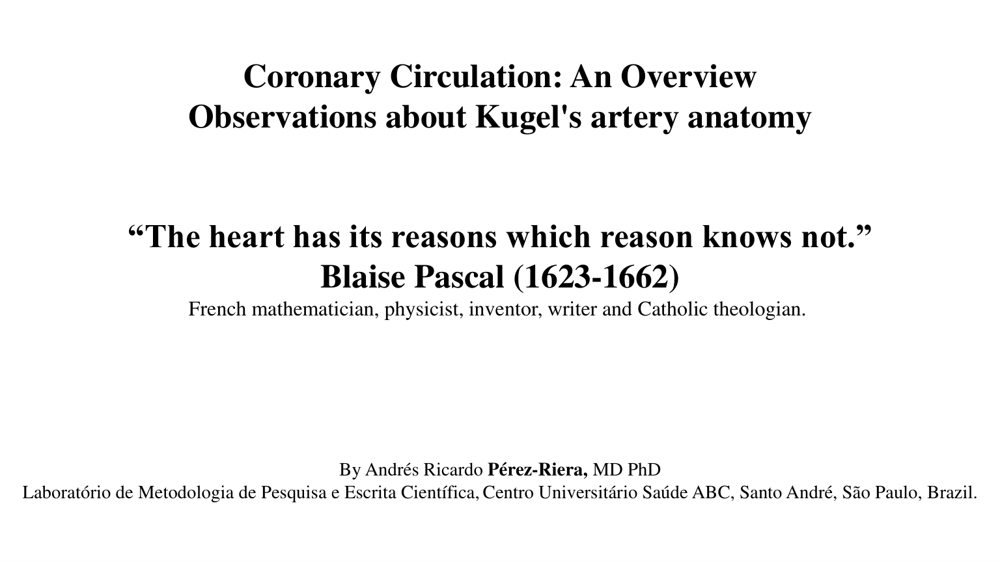

---

## 第 2 页

冠状动脉向心脏供应含氧血液，而心脏静脉在血液脱氧后将其排出。心脏循环是
不仅对它自己的组织而且对整个身体甚至大脑每时每刻的意识水平都具有重要意义。冠脉循环中断很快会导致心肌梗塞，心肌因缺氧而受损。这样的
中断通常是由冠状动脉疾病引起的，有时是由其他原因引起的栓塞引起的，例如血流阻塞
船只。冠状动脉向心肌和其他心脏成分供应血液。两条冠状动脉起源于左侧
心脏位于主动脉根部，就在主动脉离开左心室之后。主动脉壁上有三个主动脉窦（扩张），略高于主动脉窦。
主动脉半月瓣。其中两个，左后主动脉窦和前主动脉窦，分别产生 LMCA 和 RCA。的
第三窦，即右后主动脉窦，通常不产生血管。残留在冠状动脉表面的冠状血管分支
沿着心脏沟的动脉被称为心外膜冠状动脉。（Betts, J. Gordon (2013). Anatomy & Physology. pp. 787–846. ISBN 1938168135. Retrieved 11 August 2014.）LMCA 将血液分配到心脏的左侧、左心室和左心室以及心室间
隔膜（IVS）。 LCX 起自 LMCA，沿着冠状沟向左延伸。最终，它会与小树枝融合在一起
RCA。较大的前室间动脉，也称为 LAD，是从 LMCA 发出的第二个主要分支。它遵循
肺干周围的前室间沟。

一路上它产生了许多较小的分支，这些分支与
室间后动脉（LPD）的分支，形成吻合。吻合是血管联合形成的区域
即使另一个分支可能部分堵塞，通常也允许血液循环到一个区域的互连。吻合术位于
心很小。因此，这种能力在心脏中受到一定程度的限制，因此冠状动脉阻塞通常会导致心肌梗死细胞死亡
由特定船只提供。 RCA 沿着冠状沟行进，将血液分配到 RA、两个心室的部分以及
冠状动脉循环：概述

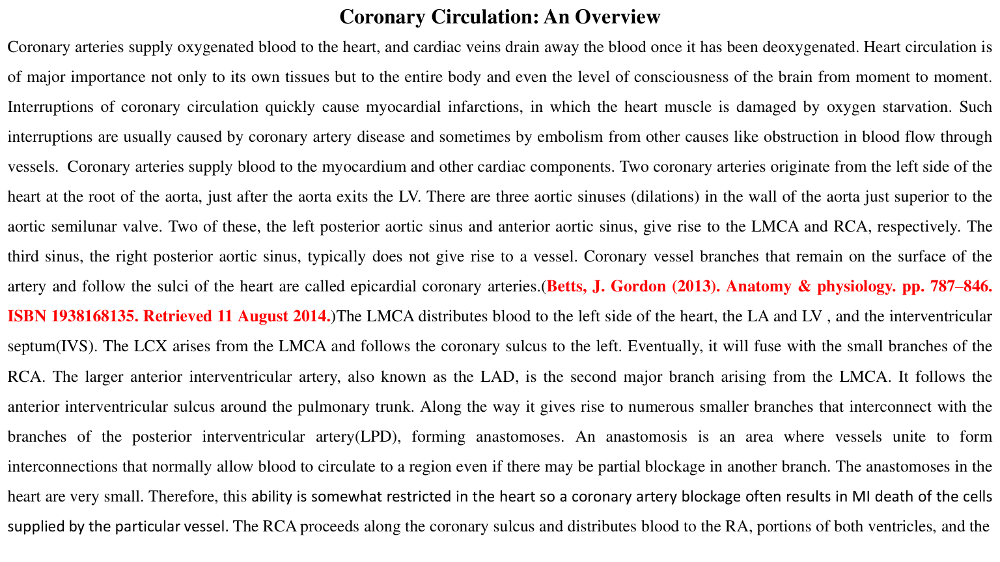

---

## 第 3 页

传导系统。正常情况下，一根或多根边缘动脉源自位于 RA 下方的 RCA。边缘动脉供应血液
RV 的表面部分。在心脏后表面，RCA 产生后降动脉（PDA）。它沿着
室间沟的后部朝向心尖，产生供应室间隔的分支，
两个心室的部分。 （Betts, J. Gordon (2013)。解剖学与生理学。第 787–846 页。ISBN 1938168135。2014 年 8 月 11 日检索。）。吻合术
两条冠状动脉的分支之间有一些吻合。然而，冠状动脉在功能上是终末动脉，所以
这些连接被称为潜在的吻合，其缺乏功能，而不是像手掌中的真正的吻合。这个
是因为一条冠状动脉的阻塞通常会由于另一条冠状动脉缺乏足够的血液供应而导致心脏组织死亡
分支。当两条动脉或其分支连接时，心肌区域获得双重血液供应。这些连接称为吻合。如果一根冠状动脉被粥样斑块阻塞，第二根动脉仍然能够向心肌供应含氧血液。然而，这
只有当粥样斑块进展缓慢，使吻合有机会增殖时，才会发生这种情况。最常见的配置下
冠状动脉有3个吻合区域。左冠状动脉 LAD 分支的小分支与 PDA 分支连接
RCA位于室间沟（沟）。更优越的是，LCX（LMCA 的一个分支）和 RCA 之间存在吻合。
房室沟。

室间隔内两冠状动脉的间隔支之间也有吻合。变化
左和 RCA 偶尔会出现一个共同的主干，或者它们的数量可能会增加到三个；附加分支是后部
冠状动脉（尺寸较小）。在极少数情况下，第三冠状动脉会围绕主动脉根部运行。

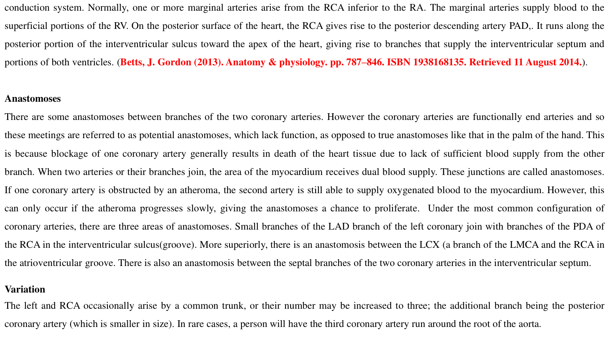

---

## 第 4 页

有时，冠状动脉会以双重结构存在（即有两条动脉，彼此平行，而通常情况下会有两条动脉）
一）。
冠状动脉优势
冠状动脉优势是由产生后降支动脉 (PDA) 的血管定义的，后降支动脉为心肌供血
室间隔下1/3。大多数心脏（80-85%）是右优势心脏（RD），其中 PDA 由 RCA 提供。的
供应室间隔后三分之一的动脉 - PDA 决定冠状动脉优势。（Gorlin R. 冠状动脉）
解剖学。主要Prob Int Med 1976；11：40-58。 )(Knaapen M, Koch AH, Koch C, et al. 左侧和平衡的患病率
尸检时，冠状动脉优势随着患者年龄的增加而降低。死后冠状动脉造影
研究。 Cardiovasc Pathol 2013;22:49–53.) (Fuster, V; Alexander RW; O'Rourke RA (2001). Hurst's The Heart (10th ed.). McGraw-
山。 p。 53.ISBN 0-07-135694-0。）。总之，根据冠状动脉的起源，将冠状动脉优势分为 LD、RD 或 CD
后降支 (PDA)
➢如果PDA由RCA提供，则冠状动脉循环可归类为“右优势”(RD)。70%的病例；
如果PDA由左动脉的一个分支L(CX)供血，那么冠状动脉循环可分为“左-
占主导地位“(LD)。20% 的案例；
如果PDA由RCA和LCX同时提供，则冠脉循环可分为“共同主导”或“平衡”
冠状动脉优势”或 CD。≥10% 的病例。参见下一张幻灯片中的图。

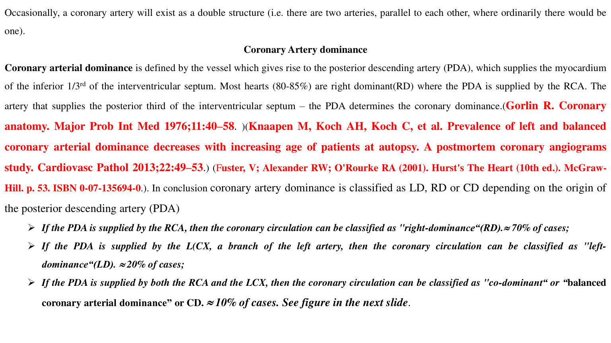

---

## 第 5 页

I. 右翼统治 II.   左翼主导
我。
如果后降动脉 (PDA) 由右冠状动脉 (RCA) 供血，则冠状动脉循环可
归类为“右优势”。
二.
如果后降动脉 (PDA) 由左回旋动脉（LCX） 供血，则冠状循环可
归类为“右优势”。
1.
右冠状动脉 (RCA)； 2.左回旋动脉（LCX）； 3. 后降动脉（PDA）； 4. 左主冠状动脉
动脉； 5. 左前降支 (LAD)

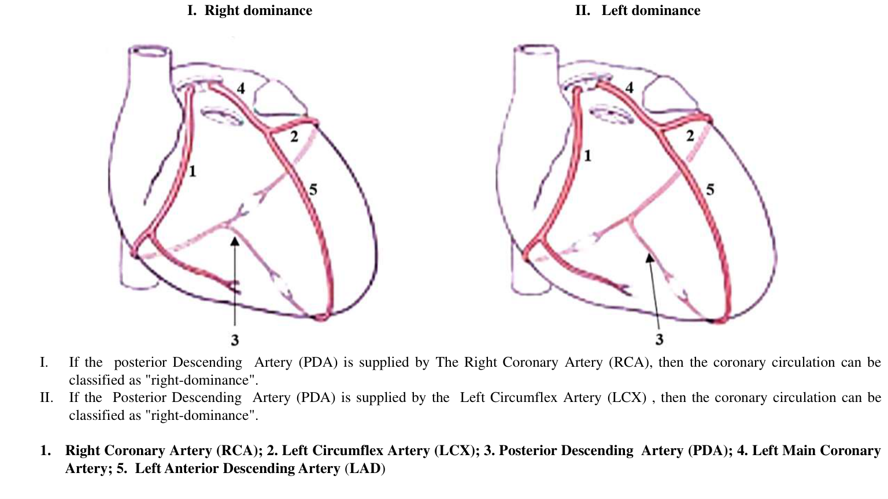

---

## 第 6 页

右冠状动脉优势对三支冠状动脉疾病的影响
最近，Peng L 等人（Liyuan Peng 1、Xin Cheng Gu 2、Ya Gau 3、Qiguo 4、Jingjing Zhu 3、Bangjia Fang 5、Bin Yan 1）的影响。
三支冠状动脉疾病的右冠状动脉优势：一项横断面研究。医学（巴尔的摩），97 (32)，e11685
2018年8月 PMID: 30095625 PMCID: PMC6133631 DOI: 10.1097/MD.0000000000011685) 调查右冠脉之间的关系
有或没有明显冠状动脉疾病（CAD）的患者的优势和冠状动脉造影特征。
该研究共招募了2225名2011年1月至2014年11月期间接受冠状动脉造影的患者。基于
根据冠状动脉造影结果，将患者分为左显性（LD）组、右显性（RD）组和共显性（CD）组
组。应用多项Logistic回归分析冠状动脉优势与三支血管CAD之间的关系。
他们发现 RD 患者的三支血管 CAD 患病率较高（36.6% vs 27.3%，P = .008），且 RCA 显着狭窄
（40.5% vs 29.2%，P = .001）。此外，多项Logistic回归分析结果表明，RD与
三支血管疾病（优势比 1.768，95% 置信区间 1.057–2.956，P = .030）。
总之，RD 与患者的三支血管 CAD 呈正相关，而不是 LD 或 CD。这一结果表明 RD 可能是一种风险
RD 患者应采取三支血管 CAD 的因素，采取更有效的措施来预防致命的心血管事件。

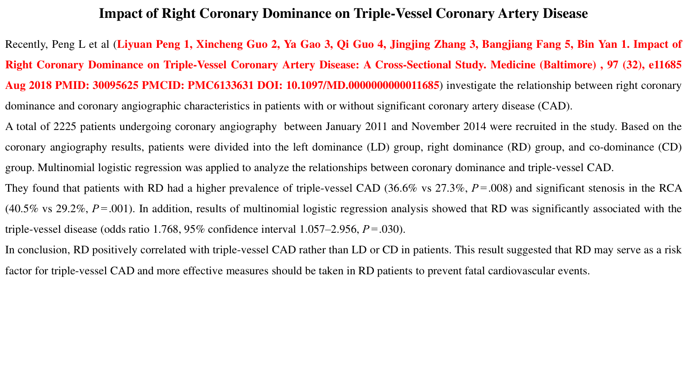

---

## 第 7 页

哺乳动物心脏的乳头肌
乳头肌（PM）是位于哺乳动物心脏心室中的不随意肌。它们是二尖瓣的组成部分
阀门装置。该装置有六个组成部分：1) 左心房壁，2) 二尖瓣环，3) 二尖瓣小叶，4) 腱索
腱，5) 乳头肌，6) 左心室壁。这是一个复杂的三维功能单元，对于
单向心脏泵功能。最后一个附着在房室瓣的尖端（二尖瓣和乳头肌是
存在于哺乳动物心脏心室中的不随意肌。它们支撑三尖瓣和二尖瓣。的
当乳头肌放松时，乳头肌收缩打开这些值，瓣膜关闭。腱索连接
乳头肌至瓣膜。腱索将乳头肌通过腱索连接到三尖瓣并收缩
防止心室收缩期间心房内这些瓣膜的倒置或脱垂）（Moore KL 等人，2007 年）。 PM 的组成
约占心脏总质量的10%。结构
心脏共有五块乳头肌；三个在右心室，两个在左心室。前乳头、后乳头和间隔乳头
右心室的肌肉均通过腱索附着到三尖瓣。通常有两个乳头肌从之间的区域产生
左心室游离壁的顶端和中间三分之一。前外侧乳头肌通常由一个体部或头部组成，而前外侧乳头肌则由一个体部或头部组成。
后内侧乳头肌可能有两个或多个头。

每个乳头肌都为两个小叶提供腱索，并且两者的轴向关系
腱索可防止腱索磨损或不同步。乳头肌附着于左室侧壁表明
心室也是二尖瓣复合体的重要组成部分。影响乳头肌位置的心室几何形状的任何变化都可能
改变腱索和小叶的轴向关系，导致瓣膜功能障碍

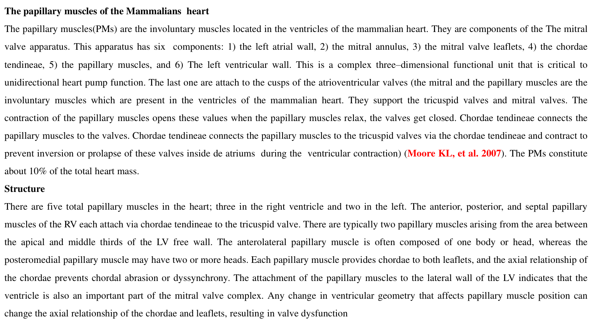

---

## 第 8 页

供应乳头肌
乳头肌连接二尖瓣（左心室和左心室之间的瓣膜）和三尖瓣（右心室和右心室之间的瓣膜）
RV）到心壁。乳头肌是位于心室的肌肉。它们附着在
房室瓣通过腱索收缩并收缩以防止这些瓣膜在收缩时倒转或脱垂。如果乳头肌
如果功能不正常，二尖瓣可能会在左心室收缩时发生渗漏。这导致一些血液“反向”流动，从
LV 到 LA，而不是向前到主动脉和身体的其他部位。这种血液泄漏到 LA 的现象称为二尖瓣反流。同样，
血液从右心室通过三尖瓣漏入右心房也可能发生，这被描述为三尖瓣关闭不全或
三尖瓣反流。前外侧乳头肌更频繁地接受两种血液供应：LAD 动脉和 LCX。（Voci P，Bilotta
F、CarettaQ、Mercanti C、Marino B (1995)。 “乳头肌灌注模式。缺血性乳头肌功能障碍的假设”。
流通。 91（6）：1714-8。 doi：10.1161/01.cir.91.6.1714。 PMID 7882478。）因此它更常抵抗冠状动脉缺血。上
另一方面，后内侧乳头肌通常仅由 PDA 提供。这使得后内侧乳头肌显着
更容易发生缺血。其临床意义在于，累及 PDA 的 MI 更有可能引起二尖瓣反流。

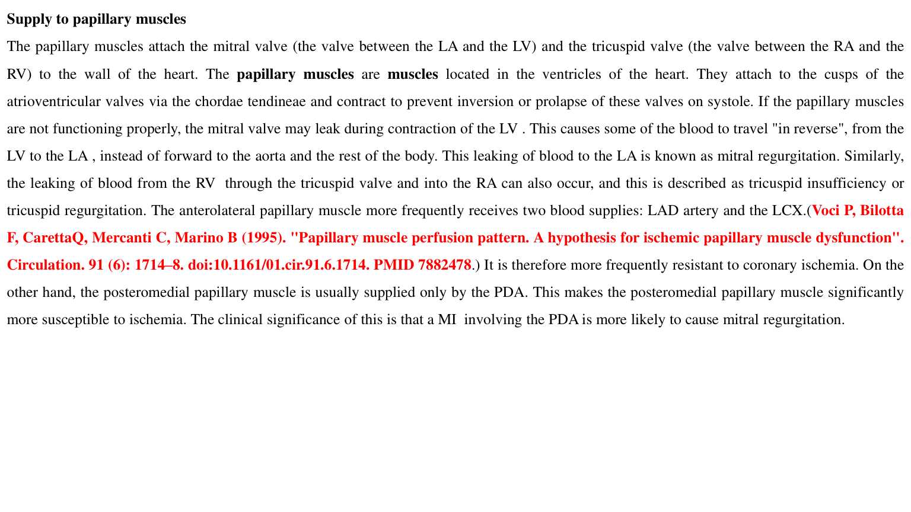

---

## 第 9 页

的
二尖瓣
阀门
仪器
是
一个
复杂的
三——
对单向至关重要的维度功能单元
心脏泵功能。主要二尖瓣装置
组成部分是：
1）
二尖瓣前叶
2）
二尖瓣后叶
3）
腱索
4）
前外侧乳头肌
5）
后外侧乳头肌
6）
主动脉瓣
Ao) 主动脉
洛杉矶）左心房
LV) 左心室
PA) 肺动脉
二尖瓣装置的组件
左室
Ao：主动脉； PA：肺动脉； LA：左心房； 6：主动脉瓣。

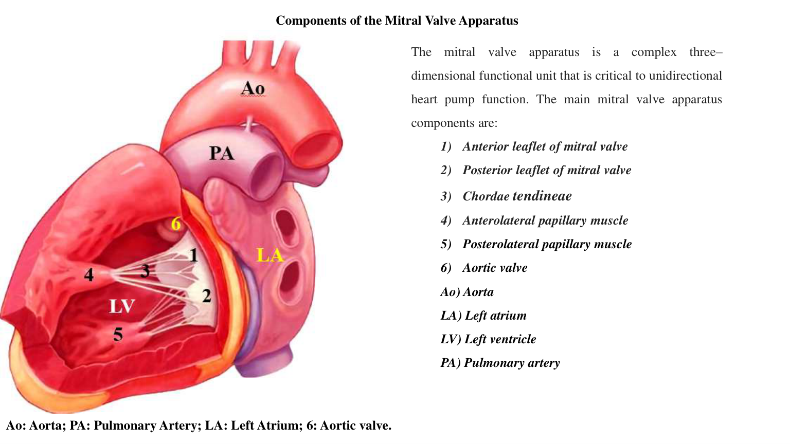

---

## 第 10 页

10毫秒
20毫秒
左室
30毫秒
牛眼（顶端短轴）
下墙
隔片
墙
横向 
墙
前壁
1
7
13
17 号
15
10
4
2
8
9
3
14
12
6
11
5
16
后降支（由 RCA 或 LCx 发出）
右冠状动脉 (RCA) 中部完全阻塞示例：R-2

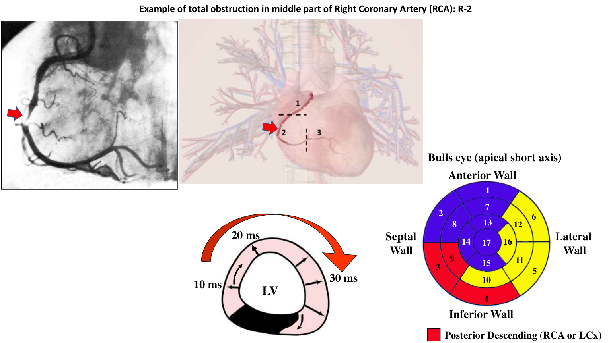

---

## 第 11 页

主要冠状动脉 冠状动脉树
我。
左主冠状动脉、左主干、左冠状动脉主干 (LMCA/LCA)、左麦干、左主干
冠状动脉干（缩写为 LMS）：LMCA 从主动脉的起源延伸至其分叉处：
▪
左前降支（LAD）
▪
左回旋动脉（LCX）。
我。
钝边缘动脉 #1 (OM1) 钝边缘动脉 #2 (OM2)
二.
后降支 (PDA)。仅占 10% 的病例（左侧为主）
二.左前降支 (LAD)：
我。
对角动脉：
1 - Dg1 或第一条对角线；
2 - Dg2 对角动脉 2 - 或第二对角线
二.
前间隔穿支分支：
我。
S1：第一间隔穿支分支；
二.
S2：第二隔膜穿孔器和
三． S3：第三间隔穿支分支
三．右冠状动脉 (RCA)：
1.
运行至右心室流出道的圆锥（动脉）动脉
2.
心房分支发出 SA 结动脉（约 60% 的心脏），沿着前 RA 延伸至 SVC，
在到达 SA 节点之前将其包围
3.
房室结支
4.
右边缘支/动脉；是一个大的边缘分支，沿着心脏的锐缘并向心脏供血
RV 的表面。
5.
后降支动脉（PDA）；它通常是 RCA 的一个分支（70%，右优势）。
6.
后外侧动脉 #1 (PL#1) 和
7.
后外侧动脉 #2 (PL#2)

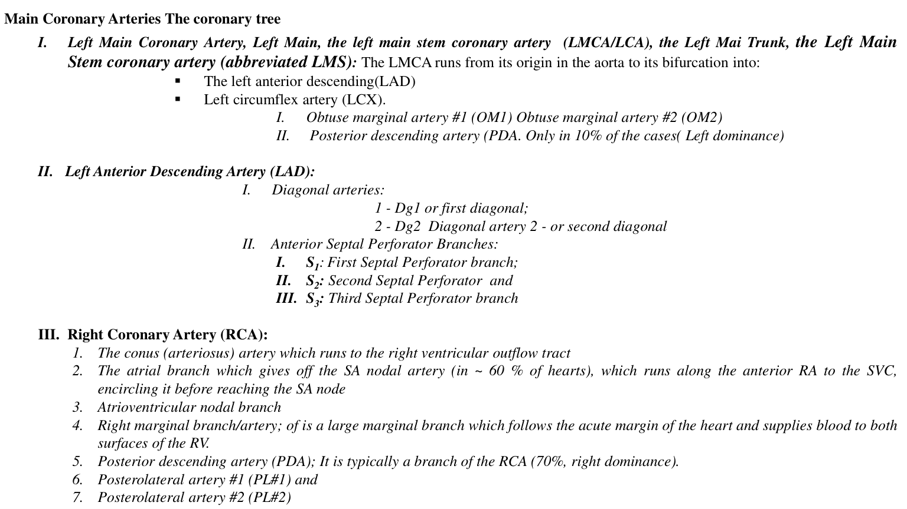

---

## 第 12 页

冠状动脉树
左主冠状动脉 (LMCA)：LMCA 分支为
旋曲和 LAD 大约 15% 的人会出现 LMCA
室间动脉。 LMCA 向左侧供血
心脏。
右冠状动脉 (RCA)：RCA 向右侧供血
的心。 RCA 产生 RCA 的窦房结分支
60% 的病例中，有 RCA 的 PDA 分支和边缘分支。用品
向 RA、RV、SA 结、AV 结供血，并帮助向
隔膜。房室结动脉供应房室结并来自
RCA。
左前降支 (LAD) 向 LA 和 LV 供血。的
LAD 向心脏、心室的前部和左侧供血
隔膜和左心室前部的大部分。
左抑扬音 (LCX)：
向 LA 和基底外侧供血
LV方面。 LCx 向左室侧壁供血
当有左心时，有时会到达心脏的基底下部
统治地位。
急性边缘动脉或 RCA 边缘分支：提供血液
向 RV 的侧面部分供电。
后下降动脉 (PDA)：向下方供应血液
隔膜的。
钝角边缘：钝角边缘分支供给劣势
直接挂墙。
RCA 的右边缘或右边缘动脉）是沿着心脏锐缘的大边缘分支，
向右心室的两个表面供血。

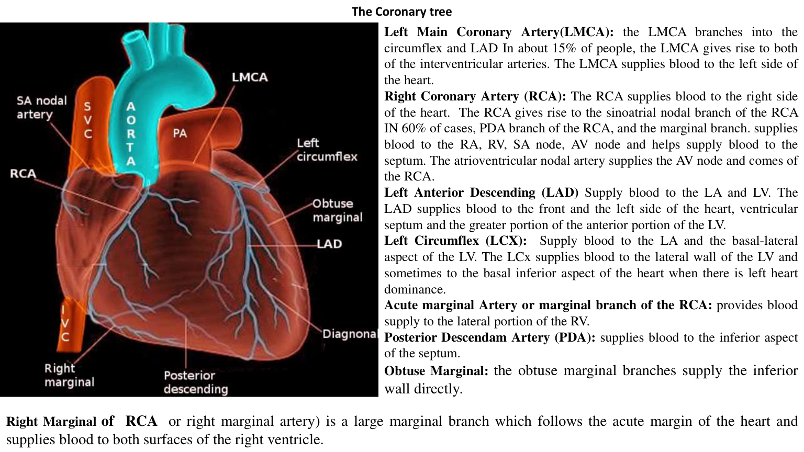

---

## 第 13 页

1
1.
左冠状动脉主干 (LMCA)
2.
左前降支 (LAD)
3.
左回旋冠状动脉（LCX）
4.
右冠状动脉 (RCA)
5.
后降动脉（PDA）。在这种情况下，由 RCA 提供，则冠状动脉循环可归类为“右优势” 
6.
第一对角线 (Dg)
7.
急性边缘 (A. Mg)
2
3
4
5
S1
S2
S3
S1：第一间隔穿支分支
S2：第二隔膜穿孔器
S3：第三隔膜穿孔器
S’：后间隔穿支
6
7
冠状动脉循环
前间隔穿支分支 
S’
S’
S’
S’
S’

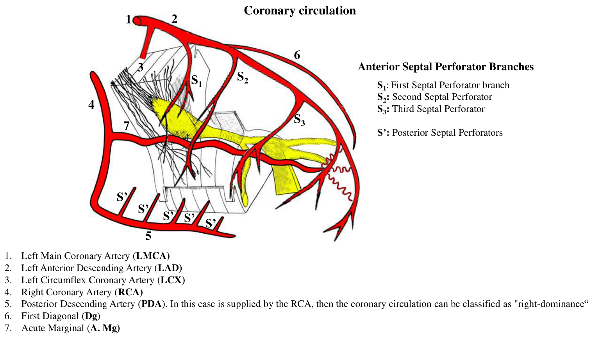

---

## 第 14 页

冠状动脉解剖。 a) 左冠状动脉
动脉和 b) 右冠状动脉。 A、心房
分支机构； AM，急性边缘动脉； AVCx,
回旋支房室沟支；
AVN，房室结动脉； CB，圆锥
分支机构； D、LAD的对角分支； LAC，左
心房的
抑扬音；
小伙子，
左
前部
下降； LAO 30° 左前斜肌
投影； LAT，左侧投影；学习管理系统，
左主干； LV，左心室分支；
MCx,
主要
抑扬音；
PD，
后部
下降；
PLCx,
后部
抑扬符
分支（钝边）； RA，右心房
分支机构； RAO，右前斜 30°
投影； RV，右心室分支；
S，间隔穿动脉；
SN，窦房结动脉。

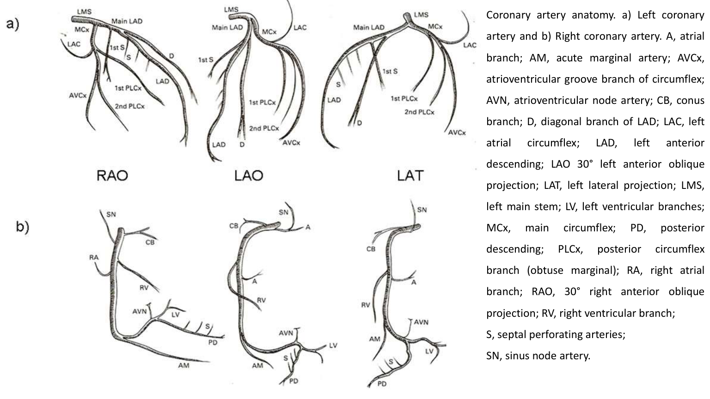

---

## 第 15 页

美国心脏协会划分 LMCA：左冠状动脉主干，LM：左主动脉，8。LAD：左前降支动脉，9
Diag 1：第一个对角分支，Diag 2：第二个对角分支，LCX：左回旋动脉，OM：钝边缘分支
LM
梯形图
诊断1
诊断2
奥姆
奥姆
PLV
左冠状动脉树

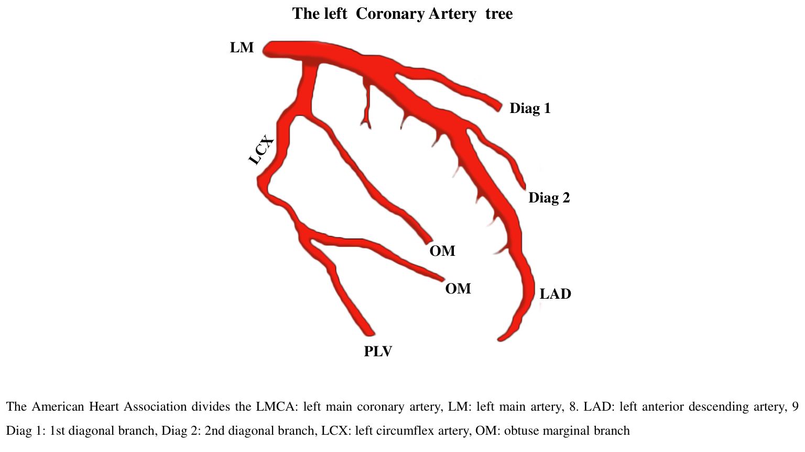

---

## 第 16 页

图：左冠状动脉尾侧右前斜位 (RAO) 视图。 LM 左主动脉，LAD 左前降支（1-3 段）， 
DIAG 1 第一个对角分支，DIAG 2 第二个对角分支，LCX 左回旋动脉（1-3 段），OM 1 第一个钝角边缘分支，OM 2 
第二钝角边枝

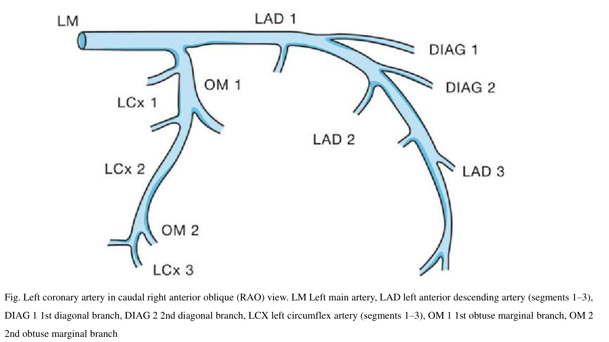

---

## 第 17 页

右冠状动脉 (RCA)  
RCA 是一条起源于主动脉瓣右尖上方、位于心脏右主动脉窦处的动脉。它沿着右冠状动脉向下行进
沟，朝向心脏的症结。它分支成 PDA 和右边缘动脉。尽管罕见，但 RCA 的几个异常课程
已被描述，包括起源于左主动脉窦（Angelini, P.（2014 年 7 月 15 日）。“冠状动脉异常的新颖成像
评估其患病率、临床症状的原因以及心源性猝死的风险”。循环：心血管成像。7 (4): 747–754。doi:10.1161/CIRCIMAGING.113.000278)。 RCA 的起点是圆锥动脉。另外，为了给身体供血
RV，RCA 提供 LV 的 25% 至 35%。在 85% 的患者（右主导）中，RCA 会发出 PDA。在另外 15% 的情况下（左
主导），PDA 由 LCX 发出。 PDA 供应下壁、室间隔和后内侧乳头肌。的
RCA 还供应 60% 的人的 SA 结动脉。另外 40% 的时间，SA 结动脉由 LCX 供血。RCA
从主动脉进入房室沟。它通过凹槽下降，然后向后弯曲，并在心脏的关键处弯曲，
继续向下至后室间沟。从主动脉出来后几毫米内，RCA 发出两个分支：1)
圆锥（动脉）动脉，运行至右心室流出道，2）心房分支，发出 SA 结动脉（约 50-
73% 的心脏），沿着前 RA 延伸到 SVC，在到达 SA 节点之前环绕它。

RCA 继续在 AV 凹槽中，
向 RA 和 RV 发出可变数量的分支。其中最突出的是右边缘分支，它沿着右侧延伸
为这部分 RV 供血的心脏边缘。当右冠状动脉向后弯曲并在冠状动脉后表面向下下降时
心，发出二至三枝。房室结动脉在心脏的关键处从 RCA 分支并向前穿过
房间隔基部供应房室结（在 50-60% 的心脏中）、希氏束支的近端部分以及房室结的部分
后室间隔包围束支。

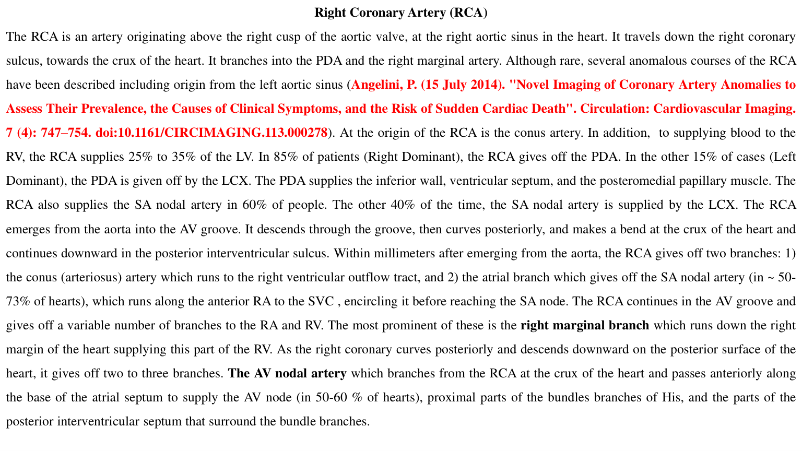

---

## 第 18 页

1.圆锥（动脉）动脉，行至右心室流出道，RCA的起点是圆锥动脉。它的支数只是
存在于约 45% 的人类心脏中，当 LAD 动脉闭塞时，它为心脏提供侧支血流。 （永利
GJ、诺罗尼亚 B、伯吉斯 MI (2008)。 “圆锥动脉作为闭塞的左前降支的侧支循环的功能意义
动脉
证明了
通过
压力
超声心动图”。国际
期刊
的
心脏病学。 140
(1)：e14-5。 doi：10.1016/j.ijcard.2008.11.039。 PMID 19108914。）（Schlesinger MJ、Zoll PM、Wessler S (1949)。“圆锥动脉：第三个冠状动脉
动脉”。美国心脏杂志。38 (6): 823–38。doi:10.1016/0002-8703(49)90884-4。PMID 15395916。）
2. 发出 SA 结/结动脉（约 60% 的心脏）的心房分支，沿着前 RA 延伸到 SVC，环绕它
在到达 SA 节点之前。这是 RCA 的第二个分支（第一个是圆锥动脉），38% 的病例来自 LCX 和
来自双侧动脉的 3%。（Kyriakidis MK、Kourouklis CB、Papaioannou JT、Christakos SG、Spanos GP、Avgoustakis DG。窦房结
通过血管造影研究冠状动脉。我是 J Cardiol。 1983 年 3 月 1 日；51：749-750。）。窦房结动脉是心脏的动脉
它为 SA 节点（心脏的天然起搏器）供电，并且在大约 60% 的病例中由 RCA 产生。在大约 40% 的情况下，
窦房动脉是 LCX 的一个分支。（Pejković B、Krajnc I、Anderhuber F、Kosutić D（2008 年 7 月）。“动脉的解剖学方面
人类心脏窦房结和房室结的血液供应”。国际医学研究杂志。36（4）：691–
8. doi：10.1177/147323000803600410。

PMID 18652764。）在不到 1% 的病例中，动脉直接异常起源于
冠状窦、降主动脉或远端 RCA。在 > 50% 的病例中，动脉实际上走行靠近动脉的上后部
房间隔。 （Click RL、Holmes DR Jr、Vliestra RE 等人。冠状动脉异常：位置、动脉粥样硬化程度和
对生存的影响——冠状动脉手术研究的报告。 J Am Coll Cardiol 1989； 13:531-537.).窦房的起源
淋巴结动脉与冠状动脉优势无关，这意味着为结动脉后部提供循环的一侧（右侧或左侧）

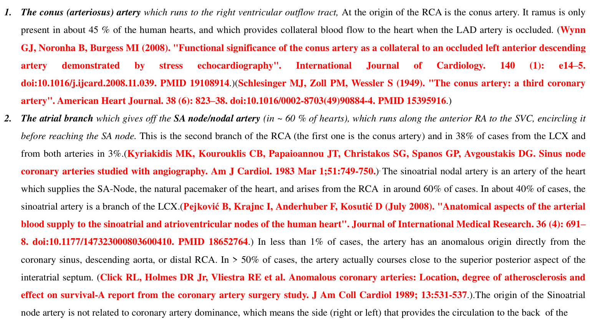

---

## 第 19 页

心。相反，房室结分支，即将血液输送到房室结的动脉，取决于冠状动脉的优势。 SA-
结节围绕窦房动脉，窦房动脉可以在结节内集中运行（70% 的个体）或偏离中心。（Sanchez-Quintana D，
安德森 RH、卡布雷拉 JA 等人。末端嵴：与电生理学相关的形态特征。心脏 2002；88：406–411。）
起源于近端 LCX 动脉的左 S 形窦房结动脉被描述为约 10% 的患者的常见变异。
（Saremi F、Channual S、Abolhoda A 等人。S 形窦房结动脉的 MDCT。Am J Roentgenol 2008；190：1569-1575。）
该动脉比正常动脉大，供应 LA 的大部分，但也供应右侧结构，如 SA 结和 AV 结的一部分
地区。在这种变体中，动脉在左上肺静脉和左心耳之间的沟中走行，在那里它可以
在导管或手术消融过程中容易受伤。 3. 房室结分支：房室结分支是至关重要的心脏动脉，因为它为房室结供血。超过80%
在心脏中，它作为靠近心脏核心的 RCA 的远端分支出现。在 18% 的情况下，AV 节点改为从 LCX 接收血液。在
约 2% 的病例，房室结的血管供应来自 RCA 和 LCX（Sow ML、Ndoye JM、Lo EA。
房室结：基于 38 例注射解剖的解剖学研究。外科放射分析 1996 年；18:183–187)
4. 右边缘支/动脉；是一个大的边缘分支，沿着心脏的锐缘并向两个表面供血
RV 的。 4. 后降支（PDA）；它通常是 RCA 的一个分支（70%，右优势）。 5.

后外侧动脉 #1 (PL#1) 和
6. 后外侧动脉#2 (PL#2)

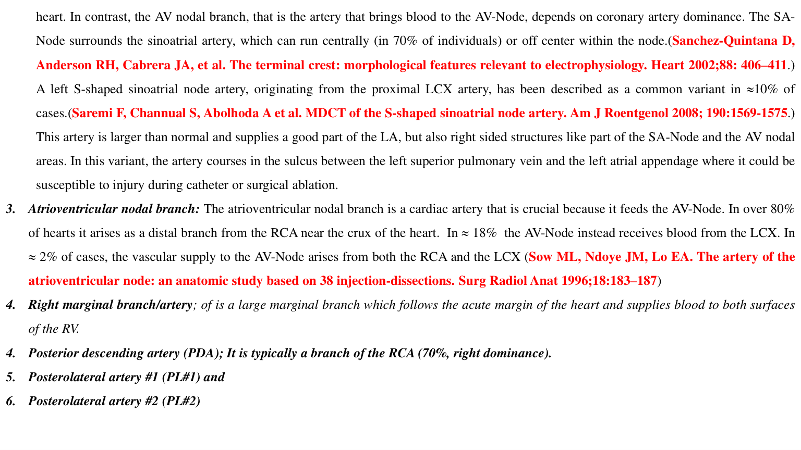

---

## 第 20 页

在大多数人（约 59% 的病例）中，SA 节点接收来自 SA 节点动脉的血液。这是 RCA 的第二个分支（第一个
其中一根是圆锥动脉），38% 的病例来自 LCX，3% 的病例来自双侧动脉。
SA节点的血液供应

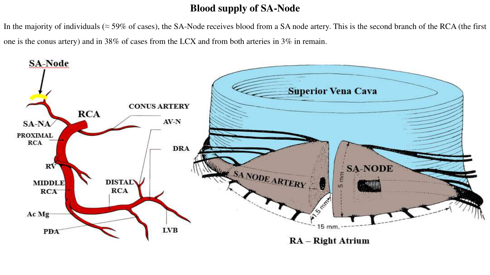

---

## 第 21 页

右冠状动脉总结 - 基本解剖学 
❑起源
右主动脉窦（起点低于左冠状动脉
❑课程
沿着右 AV 沟向下到达心脏的关键点，发出 PDA (85%)，间隔分支从中产生，继续在 LAV 沟中发出
左室后支（后外侧）。 PDA 可能起源于更近端，早期分叉或较小，提供部分“其领土”
由尖锐的边缘分支。
❑耗材
如果是左心室，则为 25% 至 35%。
右冠状动脉 - 其他分支 
❑圆锥动脉 
通常非常近端（约 50% 有单独的起点）——向前和向上越过 RVOT 朝向 LAD。可能是一个重要的 
抵押品来源。 
❑SA 结动脉
(69%) 通常为 RCA 的第二个分支 - 向后倾斜穿过房间隔上部和 RA 的前内侧壁 -
供应 SAN，通常为 RA，有时为 LA。 
❑右心室（急性边缘支）
从 RCA 中期出现；供应前RV；可能是一个侧支来源 
❑AV 结动脉
出现在症结处或附近；供应 AV 节点。
❑掌上电脑 
供应下壁、室间隔和后内侧乳头肌

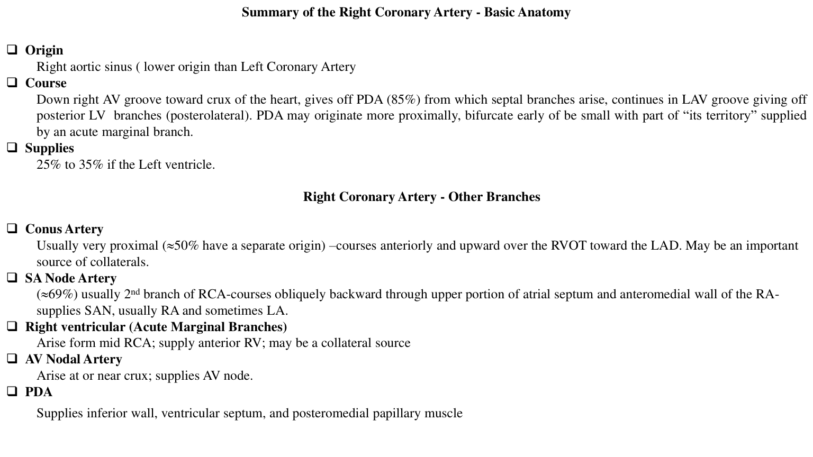

---

## 第 22 页

右冠状动脉：最佳视野
❑LAO (30°) Cranial 30°) LAO 是指将相机旋转到患者左侧（导管和脊柱将位于图像的右侧），
特别是此投影适用于远端分叉（AP Cranial 可能更好）
❑RAO：患者右侧（导管和脊柱位于图像左侧）。角度描述了图像增强器在图像中的位置
患者的短轴。
主轴；颅骨增强远端血管和非常近端的血管；尾部可能有助于牧羊人的骗子 
❑横向 
右心室分支远端分叉，尤其是颅骨分叉。
标准血管造影视图 
❑LAO 30 30°老挝
➢最适合可视化 RCA 口和近端
❑饶
➢最适合可视化中型 RCA 和 PDA
❑PA 颅骨：PA 和 30° 颅骨 
➢最适合可视化远端 RCA 分叉和 PDA

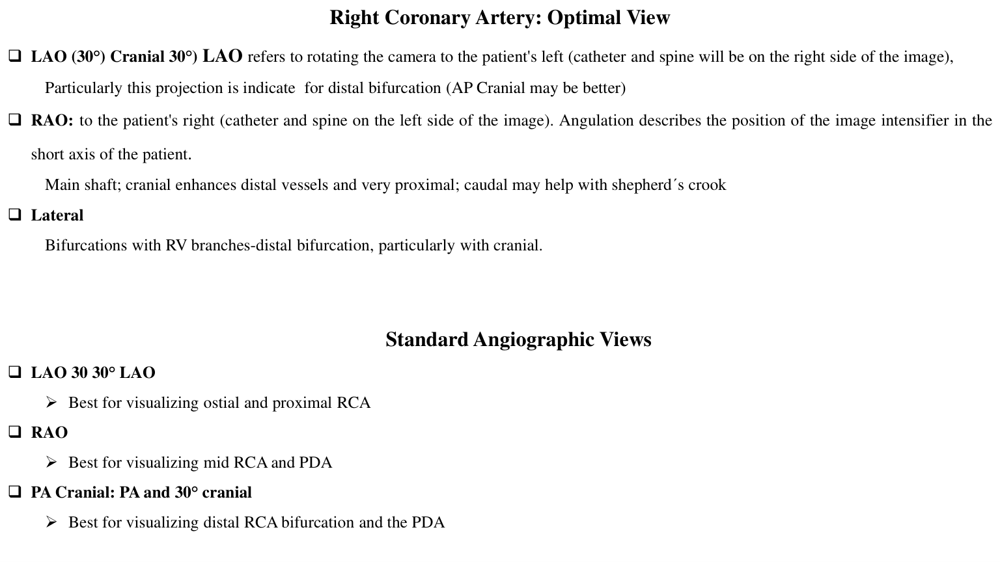

---

## 第 23 页

45° 左前斜投影与 15° 尾部角度相结合
该投影允许对 RCA 进行整体研究，尤其是清楚地定义了心核心区域 
1.
RCA 的第一（水平）部分
2.
RCA 的第二（垂直）段
3.
RCA 的第三（水平）段
4.
后室间
5.
室后动脉
6.
芋螺枝
7.
SAN的动脉 
8.
右心室动脉
9.
右边缘动脉
10. 房室结动脉
11.膈动脉
尾部 
15°
老挝
45°

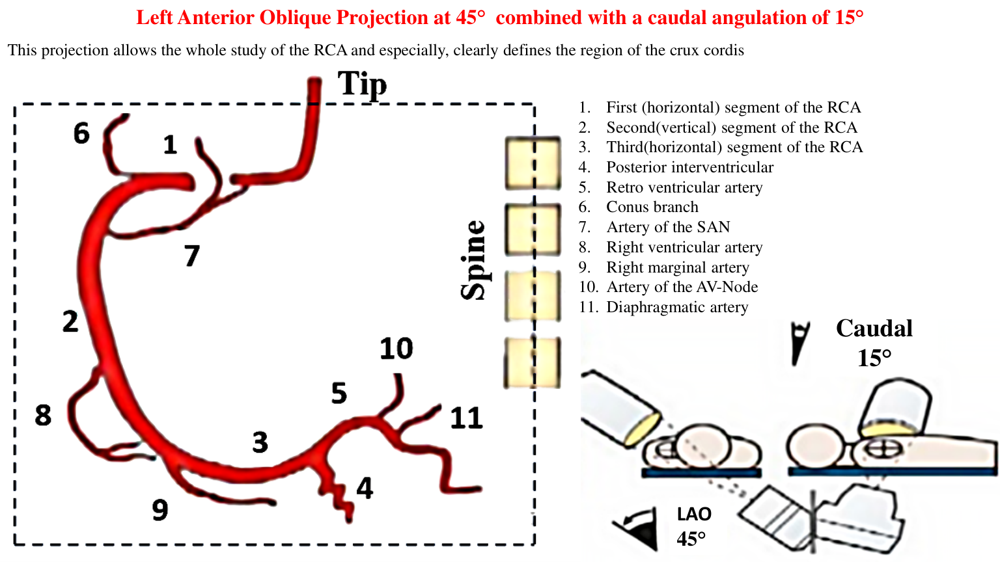

---

## 第 24 页

45° 右前斜 (RAO) 投影
45° 的 RAO 投影允许检查 RCA 的第二（垂直）段、后室间动脉和侧支动脉
分支（右心室和右边缘动脉） 另一方面，第一节段和第三节段以及 MA 作为室后动脉
动脉没有明确的定义。该投影还可以使 LAD 远端近端部分的逆行再混浊可视化
被遮挡。
1.
第一（水平）段
2.
RCA 的第二（垂直）段
3.
第三（RCA 的水平段）
4.
掌上电脑
5.
室后动脉
6.
芋螺枝
7.
SAN的动脉
8.
右心室动脉
9.
右边缘动脉
10. 房室结动脉
11. 间隔下动脉 
饶45°

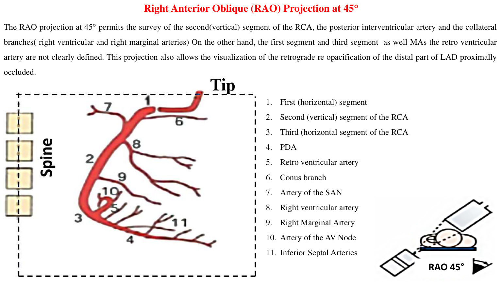

---

## 第 25 页

右前斜投影 120° 与颅角 10° 相结合
该投影对于研究第三水平段、心核心、心室后动脉及其分支非常有用。
1.
第一个（RCA 的水平部分
2.
RCA 的第二（垂直）段
3.
RCA 的第三（水平）段
4.
后室间动脉
5.
室后动脉
6.
膈动脉

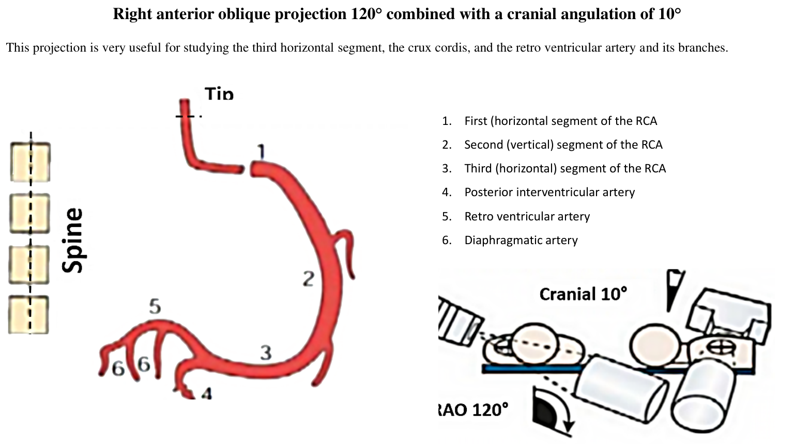

---

## 第 26 页

左侧投影
该投影允许研究 RCA 的第二（垂直）节段和侧支（圆锥支 RV 动脉、右边缘动脉） 
动脉 
1.
RCA 的第一个水平段
2.
RCA 的第二（垂直）段
3.
RCA 的第三（水平）段
4.
后室间动脉
5.
室后动脉 
6.
圆锥支]窦房结动脉
7.
右心室动脉
8.
右边缘动脉 
9.
间隔下动脉  
90°

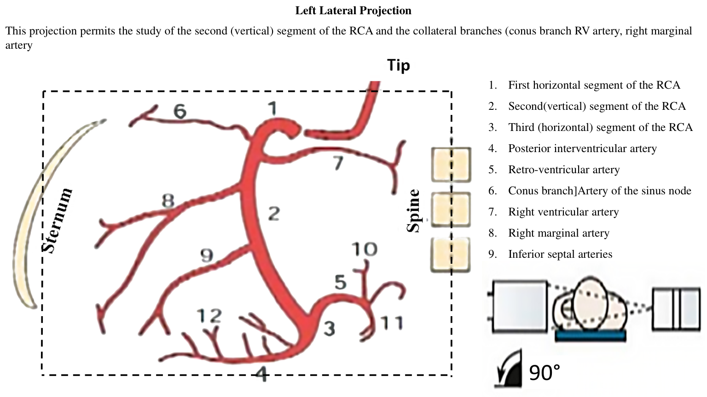

---

## 第 27 页

右冠状动脉 (RCA)：近端、中端和远端部分
1
2
3
1、RCA近端部分：R-1段； 2、RCA中部：R-2段； 3、RCA远端：R-3段。

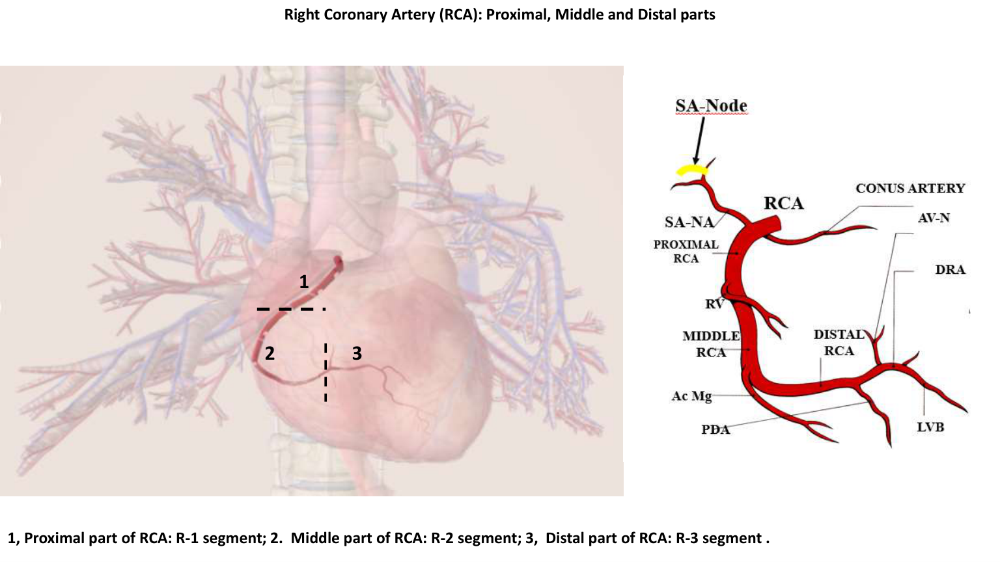

---

## 第 28 页

冠状动脉造影 右冠状动脉 RCA
左前斜位 (LAO) 视图、头颅（左）和右 RCA 的 CTA 重建
前斜（RAO）（无颅侧或尾侧（右）角度。下图是
在对比血管造影中看到的图像的称呼
RAO 右前斜肌

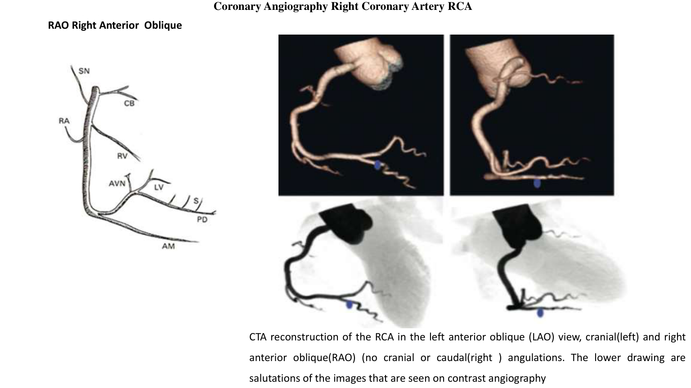

---

## 第 29 页

包括口在内的近端 RCA（R1 段）在 30° LAO 视图中最清晰可见，没有颅侧或尾侧角度。
R1：RCA 的近端部分： R2：RCA 的中部 
RCA； R3：RCA 远端部分。
R1
R2
R3

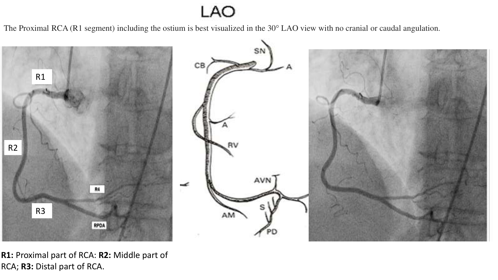

---

## 第 30 页

RCA 右冠状动脉， 
RV 右心室分支， 
AM 急性边缘支， 
PLV 后外侧心室支， 
PDA 后降支动脉， 
美国心脏协会冠状动脉树分部

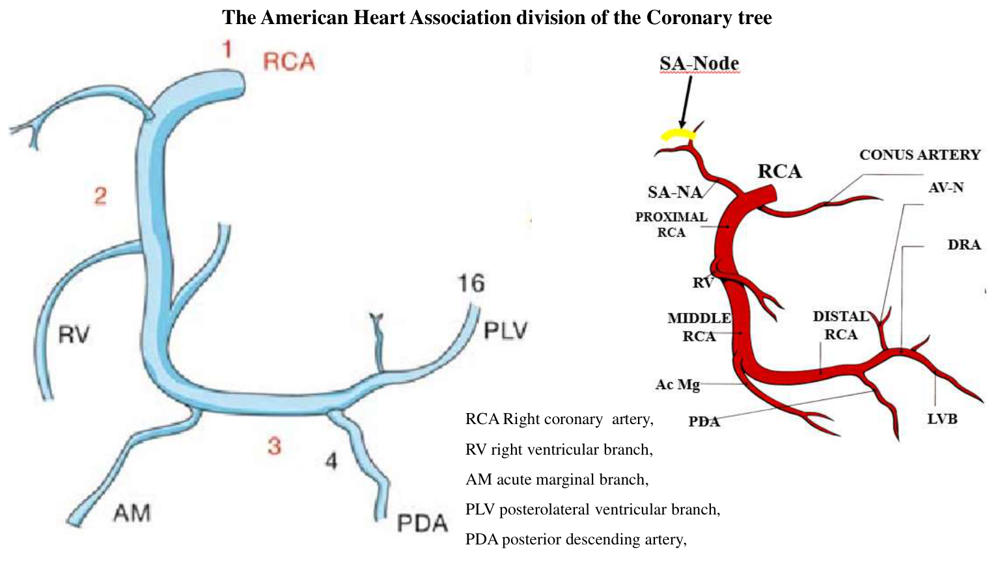

---

## 第 31 页

相机与颅侧成 15° - 20°，LAO 角度最小化至 5° - 10°。该视图优化了分叉
远端 RCA，右后外侧动脉和后降支从远端 RCA 分出并分支。的
注射期间患者应深呼吸并屏住呼吸，以优化视野。
RCA 的分叉
R1 = 近端 RCA； R2 = 中 RCA； R3 = 远端 RCA； RPDA = 右后降支动脉。
R1
R2
R3
RPDA
R4

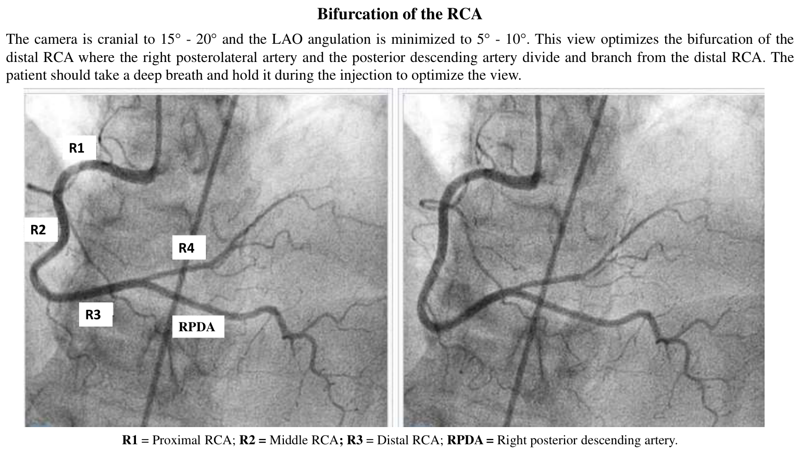

---

## 第 32 页

中RCA
中间 RCA（R2 段）在 30° RAO 直视图中最清晰可见。
R1 = 近端 RCA； R2 = 中 RCA； R3 = 远端 RCA； RPDA = 右后降支动脉。

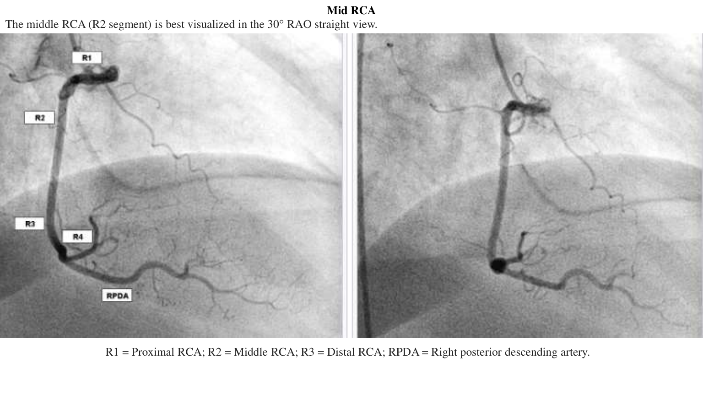

---

## 第 33 页

左束支
AV 交界区可分为 3 个区域，如下所示： 
1.
移行细胞区 = AN：心房区
2.
紧凑 AV 节点 = N：节点区域
3.
AV 束的穿透部分 = NH
4.
希束的穿透部分 = H
交界区或房室区 
AN
氮
NH
H
RBB
左臂BB
他的节点区域（AV 包的穿透部分）
的小册子 
詹姆斯
磷
中号
一个
右束支 
他的捆绑包（非分支部分）
WENCKEBACH 中节间束
前节内束
后节间束或 Thorel 束 
节点区域（紧凑部分）
心房结区（移行细胞区）

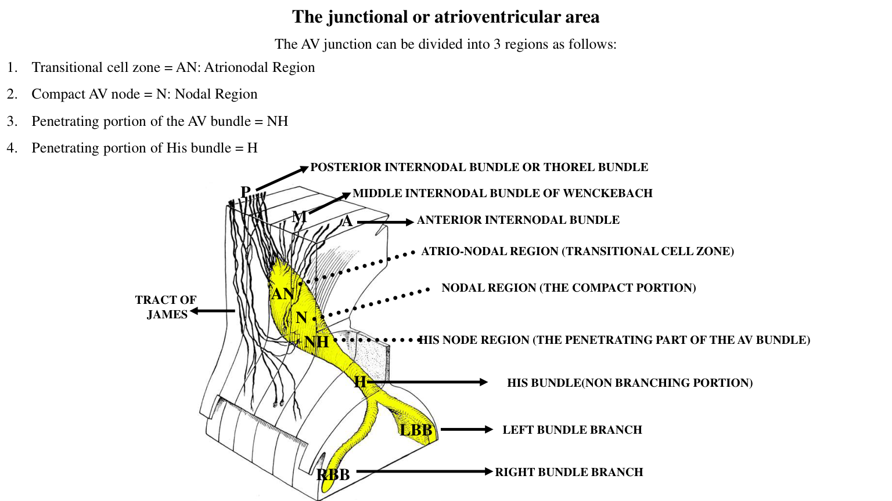

---

## 第 34 页

1.
Hadziselimović H. 人类心脏传导系统的血管化。 Acta Anat（巴塞尔）。 1978；102：105-110。
2.
安德森 RH、何 SY、贝克尔 AE。重新审视人类房室交界处的解剖结构。阿纳特 Rec。 2000 年 9 月 1 日；260:81-91。
3.
Lumg G，单层 HP。房室结和希氏束的血液供应：猪、狗和人的比较研究 Am J Pathol。 1962 年 7 月；41:65-75。
在 85% 的病例中，房室结从 RCA 接收血液供应。其余 13% 由 LCX 产生，2% 由双动脉产生1。
房室结在传导总轴穿透中央纤维体2的点处成为房室希氏束。
他束的血液供应
该结构具有双重血液供应：来自 LAD 和 PDA3 的分支。
❑左束支 (LBB) 的血液供应 PDA 分支（RCA 的 90%）：房室结动脉：隔支
纤维化、脑室上支和嵴支。   
❑LAD 的分支：左边缘支（相当于 LDA 的右边缘支）。因此，LBB 的血液供应为
双：
RCA
房室
分行
（90%
的
心）
和
隔膜
穿孔器
分支机构
的
的
梯形图
（10%
的
心） https://www.pharmacology2000.com/Cardio/Cardio_risk/adult_cardiac_procedures/anatomy4.htm
）
紧凑型房室结的血液供应

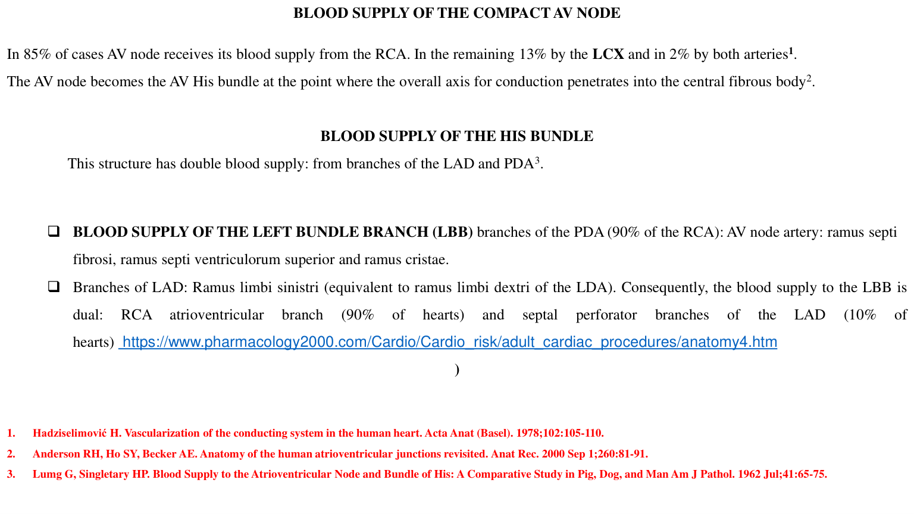

---

## 第 35 页

我。
近端部分：1+2由房室结冲洗
RCA 动脉和第一间隔穿支
LAD 的动脉 (S1)。
二.
中间部分：3 由后间隔冲洗
PDA 和第二隔膜的穿支
LAD 的穿支动脉（S2）和 Kugel 动脉，
LCX 的分支机构。
三．中部和远端部分：4个由
“右旋支”，LAD S2 的分支。
右室右隔膜表面的右束支

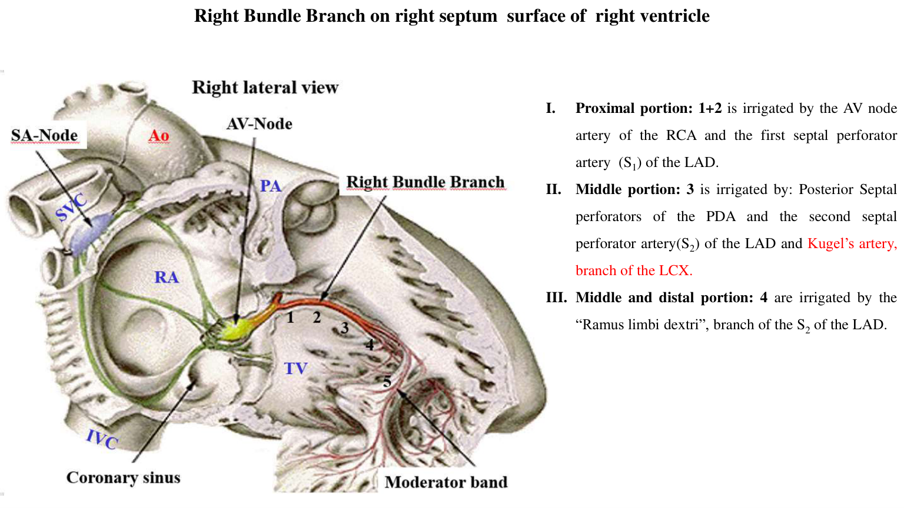

---

## 第 36 页

LSF
左臂BB
近端部分由 RCA 的 AV 结动脉冲洗
和 LAD 的第一间隔穿支动脉 (S1)。
中间部分通过以下方式灌溉：
Ø
PDA 后间隔穿支
Ø
LAD 的第二间隔穿支动脉 (S2)
Ø
库格尔动脉，LCX 的分支。
中部和远端部分：由以下设备灌溉
“右旋支支”，LAD S2 的分支。
1）他的右侧穿透部分。                                                
2）他的右分支部分
3) RBB的近端或膜状
4) 中层、心肌内或模拟
5）下、远端、调节带（MB）或间隔边缘小梁（拉丁语：trabecula septomarginalis）：它是心脏组织的肌带
右束支 (RBB) 的血液供应
6.
RBB 的部门 
在RV自由墙上
隔片
RBB

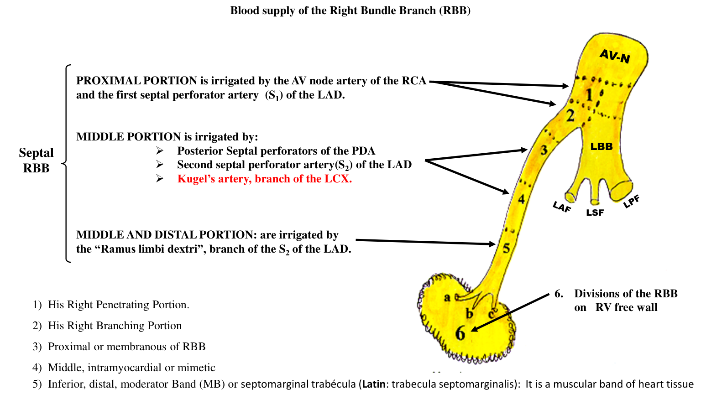

---

## 第 37 页

发现于三尖瓣前乳头肌基底部至室间隔的右心室。 MB是一个重要的结构
因为它将心脏传导系统房室束的部分 RBB 运送到三尖瓣前乳头肌。
这种穿过心室的捷径似乎可以促进传导时间，从而使前乳头协调收缩
肌肉。人们认为它的附件可以防止心室过度扩张，并被命名为“调节带”。最早是这样描述的
列奥纳多·达·芬奇对人体解剖学的探索。放射科医生和产科医生经常使用调节带来更轻松地
在产前超声中识别 RV。 MB 是形态学 RV 中的一致结构，可以作为某些情况下的标志有所帮助
心室可能不明确（即在某些形式的先天性心脏病中）。术语“间隔边缘”是描述性的，因为肌肉
从室间隔延伸到右心室边缘，接触/连接前乳头肌的基部。 MB 不
附着于三尖瓣，但作为心脏电传导通路的一部分（隔膜 RBB 的最后部分）。

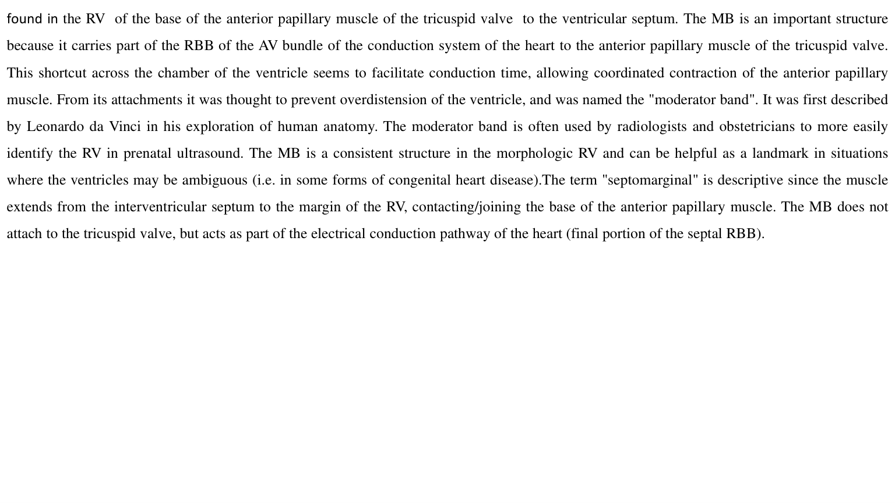

---

## 第 38 页

右心室不同部分的冲洗方式如下：
1.
RV 游离壁：RCA 干，前缘除外；
2.
右心室侧壁：急性边缘支（Ac.Mg）、右边缘支或右边缘支、右边缘支
冠状动脉（或右边缘动脉）是沿着心脏急性边缘并供应血液的大边缘分支
到达右心室和心尖部的两个表面。
3.
RV 前表面：RCA 右心室分支；
4.
RCA锥支：隔膜的一部分；
5.
后降支（PDA）：（86% 的病例为 RCA 分支）：RV 后壁。在 14% 的情况下，PD 是 Cx 的分支。
注意：在少数情况下，前降支 (ADA) 的分支会冲洗部分 RV。这种情况发生时间较长
ADA，称为 IV 型 ADA，围绕尖端。
右心室冲洗

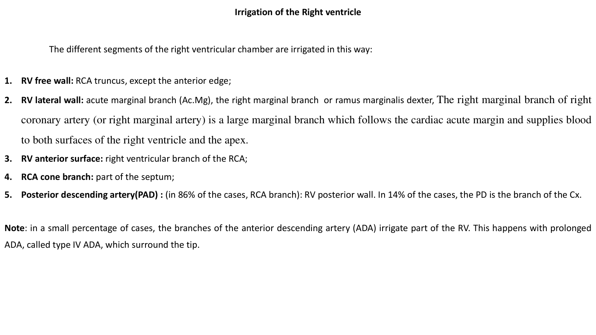

---

## 第 39 页

1.
左前束 (LAF) 由 LAD 的间隔支或房室结动脉供血
2.
左后束 (LPF)：LPF 的近端部分由动脉供应至房室结，有时也由房间隔支供应。
LAD 动脉。远端部分具有来自前（S）和后（S`）间隔穿支动脉的双重血液供应。
3.
左间隔束 (LSF)：它完全由 LAD 的间隔支提供。第一间隔之前 LAD 的严重病变
穿孔器，构成第一世界LSFB的主要原因。
左束支左束的血液供应
责任体系
拉夫
低通滤波器
LSF
法援署分支机构
40%
10%
100%
双灌 
(LAD 和 RCA)
50%
40%
0%
RCA 分支机构
10%
50%
0%

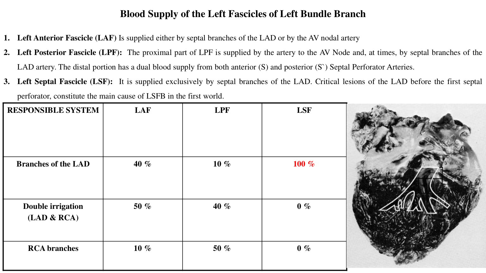

---

## 第 40 页

左冠状动脉主干概要
❑起源
左主动脉窦上部位于窦管嵴下方。长度通常为 0-10mm。很少没有 LMCA（单独的起源）。 
❑最佳视野
LAO 尾侧和颅侧； AP-尾侧、颅侧或平坦。
A-P 投影  
A-P 投影可以很好地显示 LMCA
1.
LMCA
2.
LAD 的近端部分
3.
LAD 远端部分
4.
近端LCX
5.
远端LCX
6.
左钝缘动脉
7.
第一对角动脉
8.
第一间隔穿支分支
9.
间隔动脉
10. LCX 耳支
11. 2 号钝边缘动脉

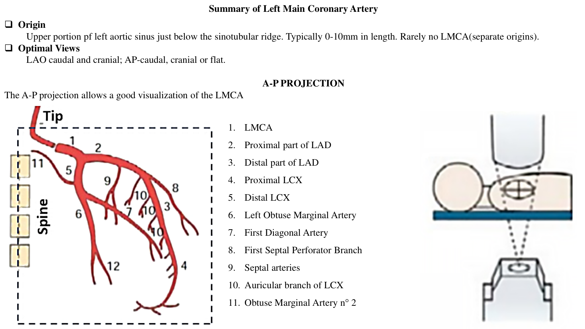

---

## 第 41 页

55/60° 的左前斜投影与 20° 的颅角相结合
20° 的颅角与 55/60° 的 LAO 投影相结合对于研究 LMCA 特别有用  
1.
LMCA
2.
LAD 的中间部分
3.
近端LCX
4.
钝缘动脉 
5.
间隔穿支分支

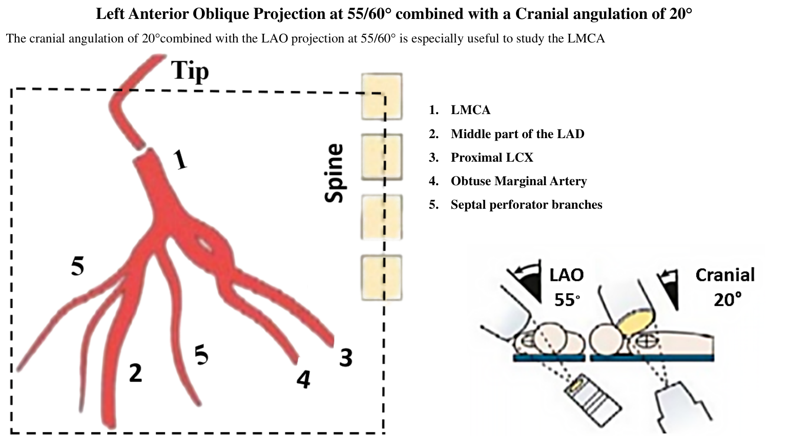

---

## 第 42 页

左前降支 
❑课程
沿着前室间沟向下，通常到达顶点。 22% 的情况下没有达到顶点。
❑分行
间隔和对角线-供应左心室的侧壁、前外侧乳头肌； 37% 有中支（像第一个对角线这样的路线）。
❑LAD
供应前外侧、心尖和隔膜：左心室的45%-55%。 
左前降支 (LAD) 是前室间室中间隔前方最大的冠状动脉
凹槽，从心脏的基部延伸到心尖。 LAD 给出了两组分支。
结构
它首先穿过肺动脉后面，然后在该血管和左心房之间向前到达前室间
沟，沿沟下降至心尖切迹。尽管罕见，但已描述了 LAD 的多个异常过程。这些
包括右主动脉窦的动脉起源。 78%的情况下，它会到达心尖。
分支机构
LAD 发出两种类型的分支：隔膜和对角线。隔膜起源于 LAD，与心脏表面成 90°，具有穿孔和
供应室间隔前2/3。对角线沿着心脏表面延伸并供应左心室的侧壁
和前外侧乳头肌。
功能
该动脉供应前外侧心肌、心尖部和室间隔。 LAD 通常供应左心室 (LV) 的 45-55%
因此被认为是心肌血液供应最关键的血管。

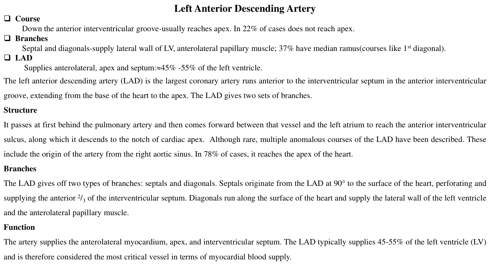

---

## 第 43 页

左图：出现 Wellens 警告的患者近端 LAD 严重狭窄 (95%)。右：再灌注后的同一患者。更多信息：韦伦斯征
“寡妇制造者”是 LAD 前室间支的别称。 （Topol，Eric J.；Califf，Robert M.（2007）。教科书
心血管医学。利平科特·威廉姆斯和威尔金斯。 p。 283. ISBN 9780781770125。检索于 2014 年 11 月 6 日。最令人担忧的类型
是近端左前降支 寡妇制造者这个名称也可能适用于 LMCA（Barbara J. Aehlert；Robert Vroman
（2011）。 “22”。今日护理人员实践：超越（第一版）。琼斯和巴特利特出版社。 p。 819.ISBN 978-0-323-08535-9。 2015 年 3 月 2 日检索。）或该动脉严重闭塞。（Richard Beebe；Jeff Myers（2009 年 12 月 11 日）。“34”。专业护理人员，
第一卷：护理人员护理基础。参与学习。 p。 764.ISBN 1-4283-2345-7。检索于 2015 年 3 月 2 日)(Carlos S Restrepo; Dianna M. E. Bardo (2011 年 1 月 1 日). Cardiac Imaging. Thieme. p. 188. ISBN 978-1-60406-186-4。检索于 2015 年 3 月 2 日。) 该术语是
之所以使用，是因为 LMCA 和/或 LAD 向心脏的大片区域供应血液。这意味着如果这些动脉突然完全
闭塞会导致严重的心梗，很可能导致猝死。致命的堵塞是由流向血小板部位的血小板组成的。
胆固醇斑块破裂。即使该区域的少量斑块也可能（由于各种鲜为人知的原因）破裂并导致死亡；绕过慢性阻塞或尝试通过血管成形术打开它们并不能预防心脏病发作，但可以在发生心脏病时恢复血液流动
突然堵塞或心脏病发作，如果在短时间内进行，可以最大限度地减少造成的损害。

灾难性后果的一个例子
LAD 动脉完全闭塞的原因是前 NBC 新闻华盛顿分社社长 Tim Russert 的突然死亡（摩根、大卫
（2008 年 6 月 13 日）。 “电视新闻记者蒂姆·鲁瑟特因心脏病去世”。路透社。原始存档于 2008 年 6 月 24 日 [6 月]
2008 年 10 月 13 日）以及电影导演凯文·史密斯的濒临死亡 (https://www.livescience.com/61863-kevin-smith-widow-maker-heart-
攻击.html）。

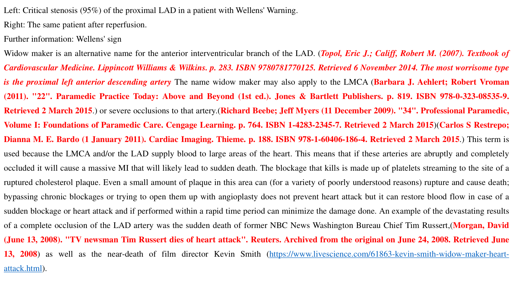

---

## 第 44 页

从寡妇制造者心脏病发作的那一刻起，生存时间从几分钟到几个小时不等。快速进展的症状应
表示需要立即关注。最初发病的症状可能包括恶心、呼吸急促、头部、下巴、手臂或胸部疼痛，
手指麻木，通常是一种新奇但不精确的感觉，伴随着不规则的心跳而产生。早期症状可能被误认为是食物
中毒、流感或全身不适，直至症状加剧。寡妇制造者不能立即杀人，但会导致心脏骤停，这可能会在 10 到 10 天内发生。
20分钟不循环。没有脉搏或呼吸的受害者仍然活着，靠血液中储存的氧气生存，如果满足以下条件，就可以获救：
在此窗口内立即开始治疗。（Kearl, Mary（2009 年 6 月）。“Surviving a Widow-Maker Heart Attack”。AOL Health。
检索日期：2009 年 6 月 22 日。）

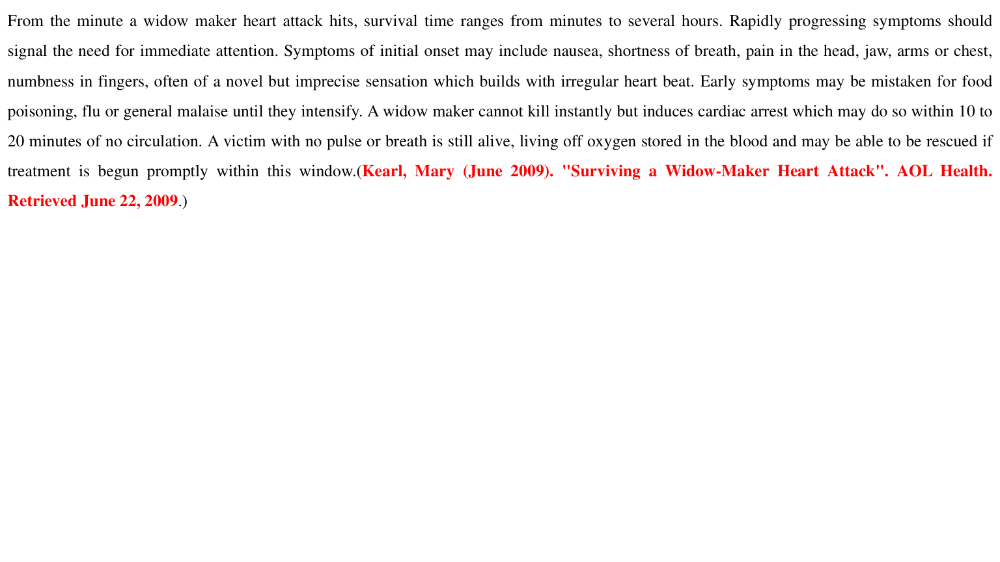

---

## 第 45 页

左回旋 (LCX)
它沿着冠状沟的左侧部分，先向左，然后向右，几乎到达后纵沟
沟。已经描述了多种异常现象，例如 LCX 与 RCA 具有异常路线。（PAGE，H.L.；ENGEL，H.
J.；坎贝尔，W.B.；托马斯，C.S.（1974 年 10 月 1 日）。 “左回旋冠状动脉的异常起源：识别，
血管造影演示和临床意义”。循环。50 (4): 768–773.doi:10.1161/01.CIR.50.4.768)
分支机构
LCX 在冠状沟内向左弯曲，产生一根或多根左边缘动脉，也称为钝边缘动脉
分支（OM1 和 OM2），因为它向心脏后表面弯曲。它有助于形成左室后分支或后外侧动脉。
心脏的左边缘动脉是回旋动脉的一个分支。它起源于后者绕过心脏的左边界
室间沟。左边缘动脉沿左边界斜行至心尖。很好
分支供应LV。在 15% 的病例中，LCX 终止于 LPD 的连接点，该点位于后部
室间沟。在其他 85% 的情况下，LPD 来自 RCA。当 LCX 在这 15% 的情况下提供 LPD 时，
称为左主导循环。
提供的结构
LCX 供应左室基底外侧和前外侧乳头肌。它还为 38% 的人提供窦房结动脉。
它在右主导系统中提供 15-25% 的 LV。如果冠状动脉解剖结构以左为主，则 LCX 供应 LV 的 40-50%。

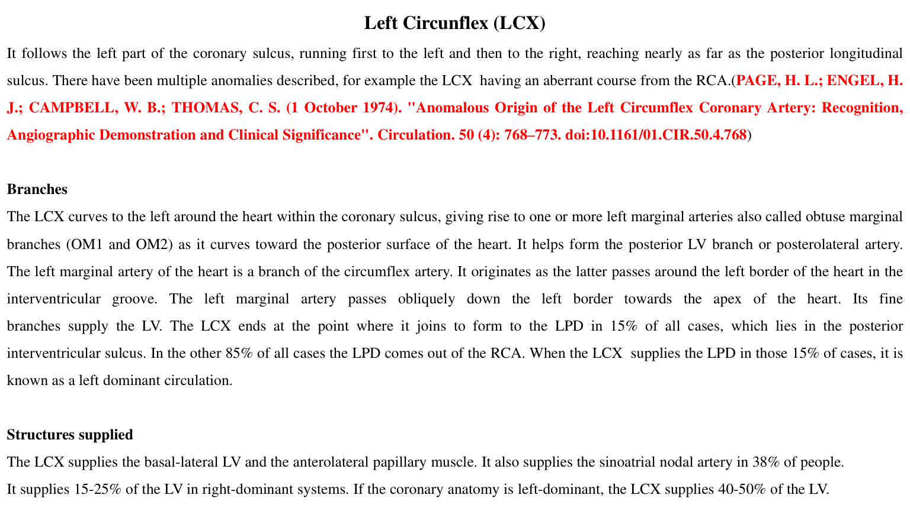

---

## 第 46 页

LCX总结
❑产地：
从远端 LMCA
❑课程
左房室沟远端下方
❑分行
钝边
后外侧供应左室基底外侧、前外侧乳头肌。
SA节点 38%
❑耗材
LV 的 15%-25%，除非占主导地位（提供 LV 的 40-50%
❑冠状动脉造影
左侧视图最能显示近端 LCX
右前斜投影 30° (RAO 30° )：30° 的 RAP 投影允许研究整个回旋系统，以及
前室间动脉的第一厘米（见下一张幻灯片）

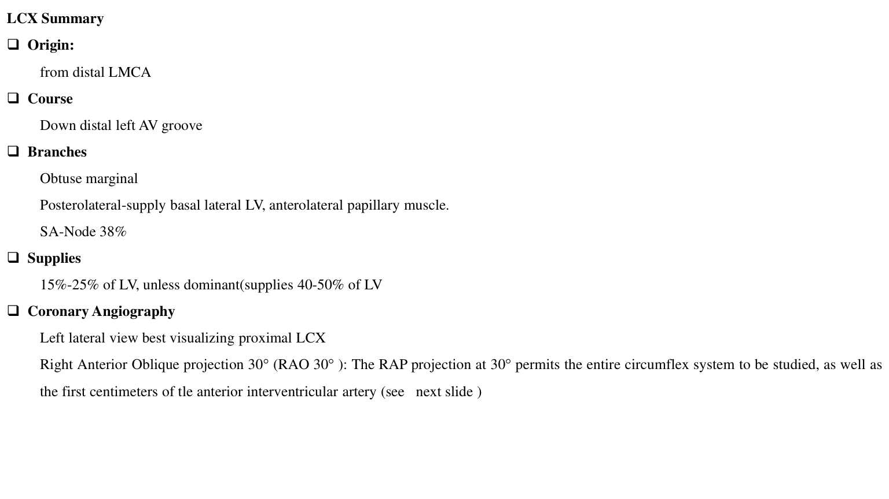

---

## 第 47 页

1.
LMCA
2.
LAD 的近端部分
3.
LAD 的中部
4.
LAD远端
5.
近端LCX
6.
远端LCX
7.
钝缘动脉
8.
第一对角动脉
9.
第二对角动脉
10. 第一隔膜穿支 
动脉
11. 间隔动脉 
12. LCX 心房分支
右前斜投影 30° (RAO 30°)

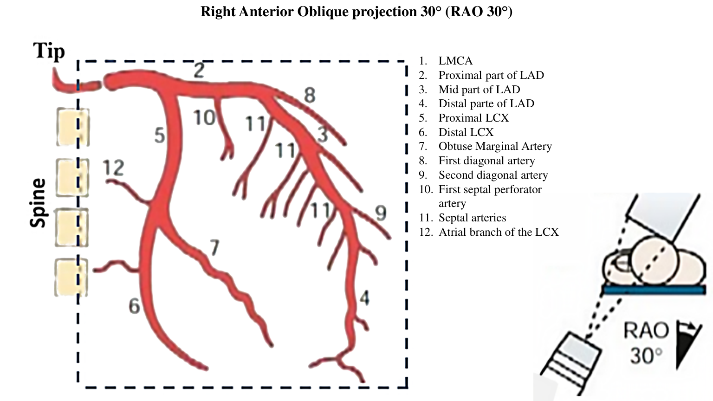

---

## 第 48 页

梯形图
RCA
LCx
短轴
垂直
长轴
基础
中
顶端
中
1
2
3
4
5
6
7
8
9
10
11
12
15
14
13
17 号
16
卧式
长轴
中
17 号
冠状动脉分布区
Cerqueira MD、Weissman NJ、Dilsizian V、Jacobs AK、Kaul S、Laskey WK、Pennell DJ、Rumberger JA、Ryan T、Verani MS；美国之心
心肌分割和心脏成像注册协会写作小组。标准化心肌分割和
心脏断层扫描成像的术语。理事会心脏影像委员会致医疗保健专业人员的声明
美国心脏协会临床心脏病学。循环。 2002 年 1 月 29 日；105(4)：539-42。

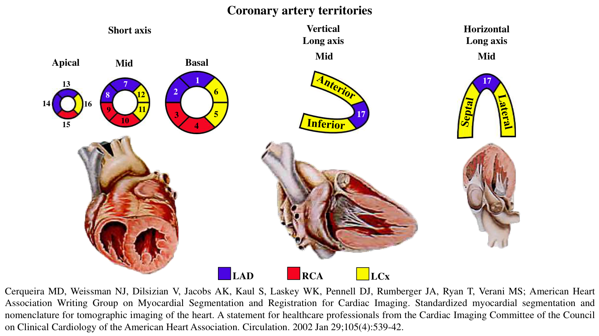

---

## 第 49 页

15
10
4
左室
洛杉矶
奥
纵向胸骨旁
牛眼（顶端短轴）
左室
左室
洛杉矶
洛杉矶
15
10
4
17 号
13
7
1
RV
RA
顶四 
室
心尖二 
室
左前降支 (LAD)
左回旋 (LCx)
后降支（由 RCA 或 LCx 发出）
下墙
隔片
墙
横向 
墙
前壁
1
7
13
17 号
15
10
4
2
8
9
3
14
12
6
11
5
16
17 号
17 号
17 号
9
3
左心室心肌分割、标准17节段模型和血管区域 
通常从垂直长轴切片中单独分析顶点。

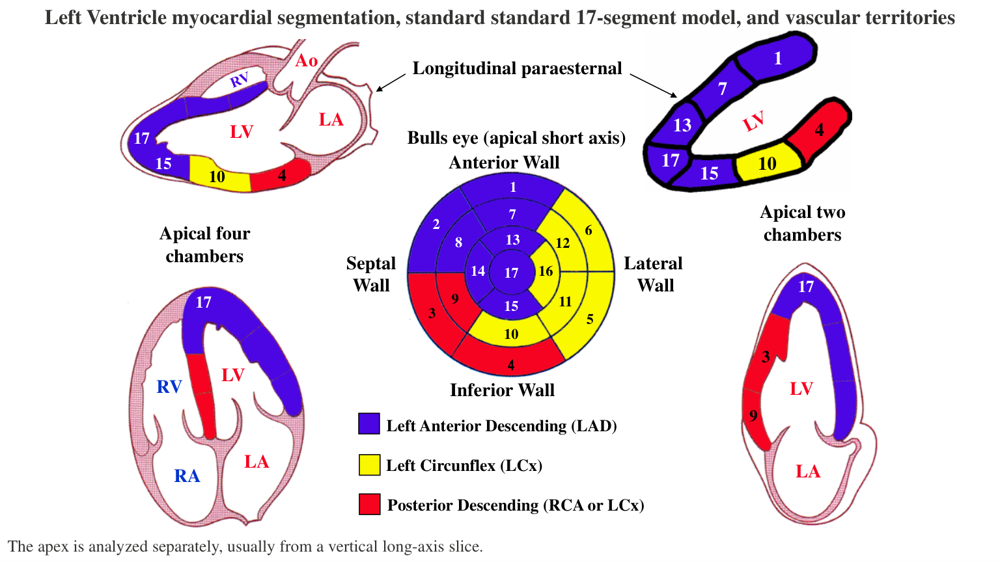

---

## 第 50 页

15
左室
17 号
10
4
胸骨旁长轴 (PLAX)
该视图是在胸骨左侧获得的，并沿其长轴观察心脏。从这个观点来看，二尖瓣、主动脉瓣、右心室
流出道、左心室底部和左心室可见。此视图中的角度可以使右心室流入道和三尖瓣
进入视野，并且以相反的方式成角度可以使肺动脉瓣进入视野。从这个角度来看，可以欣赏到长轴交叉
二尖瓣和主动脉瓣的部分。在此视图中可以欣赏到风湿性二尖瓣狭窄的经典“曲棍球棒”形状。然而，
探头与这些阀门的角度可能会导致对阀门功能障碍的低估。肺动脉瓣的胸骨旁长观是
只能看到后叶。
可见结构：左室前间隔和下侧壁；洛杉矶；二尖瓣位于长轴，有腱索；主动脉瓣长轴；
长轴（有角度）和 RVIT 中的三尖瓣；肺动脉瓣位于长轴（成角）和右心室；流出道；测量值
这个观点可以用心来量化：；左心室大小和壁厚度；左心房线性尺寸（相对于面积）；左
心室流出道直径（用于通过连续性方程计算主动脉瓣面积）；主动脉环、瓦氏窦和主动脉根
尺寸。所有四个瓣膜的彩色多普勒检查；三尖瓣和肺动脉瓣的频谱多普勒

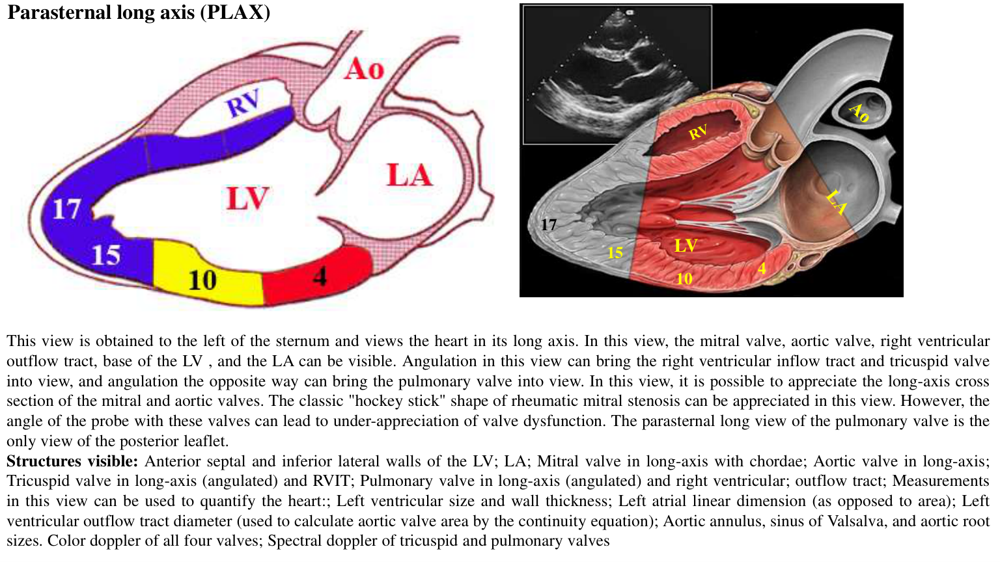

---

## 第 51 页

创意来源：Patrick J. Lynch，医学插画家； C. Carl Jaffe，医学博士，心脏病专家。 https://creativecommons.org/licenses/by/2.5

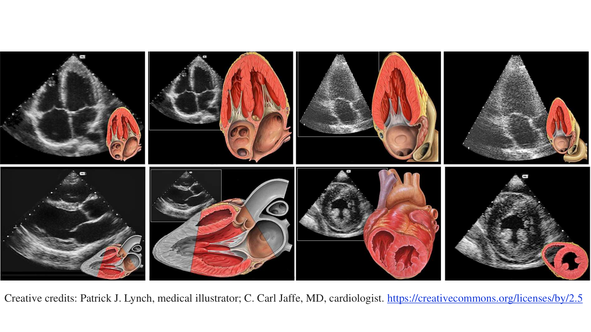

---

## 第 52 页

Kugel (Kugel MA。冠状动脉及其分支的解剖学研究。I. 耳廓大动脉吻合。Am Heart J
1927;3:260–70.）描述了一条从近端 LCx 或其分支发出的心房动脉，穿过心房下部。
在他的大多数病例中（66%）直接或通过其分支与远端 RCA 吻合。在他的其余病例中，同一条动脉
与近端 RCA (26%) 或与 LCx 和 RCA 前部以及 RCA 后部的分支形成吻合
LCx (8%)。他将这条动脉称为“耳廓大动脉吻合术”，因为它的口径很大，其吻合术的重要性显而易见。
角色，以及它在该站点上的一致出现。詹姆斯（James TN。冠状动脉解剖学。纽约：Paul B Hoeber；1961 年。第 132 页-
4.) 和 McAlpin (McAlpin WA. 心脏和冠状动脉：用于临床诊断、放射学研究和诊断的解剖图谱
手术治疗。纽约：施普林格出版社； 1975 年。 151.）在他们的解剖学研究中不接受这样一条动脉的存在。相反，
他们描述了从 LCx 或 RCA 发出的小心房分支，甚至从两条动脉发出，并相互连接或与
周围区域的其他小心房分支，然后向后走行至房间隔底部并与 AVN 吻合
动脉。尽管这些作者描述了一个吻合网络而不接受动脉的存在，但他们应用了术语“Kugel’s
动脉”到这个网络。此外，他们没有表明网络的频率。

另一方面，血管造影研究表明
存在于大心房动脉的同一区域，该大心房动脉源自 RCA 或 LCx，或通过 SN 动脉，并与 AVN 吻合
不同百分比（3.6%、4.5% 和 6%）的病例中存在动脉瘤。然而，这些作者强调，只有在严重的情况下才会发现这条动脉。
大冠状动脉的动脉粥样硬化。在提到的文献中，库格尔的动脉不容易在死后证明，并且
在体内冠状动脉造影中极难看到。 Nerantzis 等人使用大量标本和新技术，试图
解决文献中关于库格尔动脉的存在、起源、结束的混乱，
库格尔动脉解剖

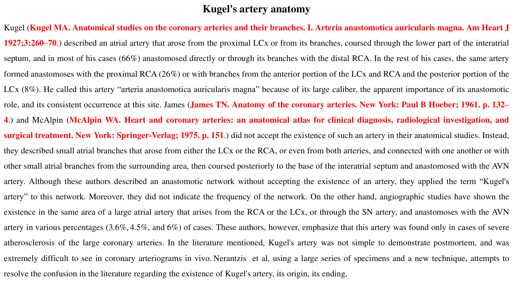

---

## 第 53 页

及其与 AVN 动脉的关系。它还试图提供有关心房内是否存在小心房动脉吻合网络的详细信息。
同一区域及其与 Kugel 动脉和 AVN 动脉的关系可能是什么。这些新的解剖学发现可能对医生有用
从事涉及心脏该区域的诊断和治疗程序的人员（Nerantzis CE1、Marianou SK、Koulouris SN、Agapitos
EB，Papaioannou JA，Vlahos LJ。库格尔动脉：使用新技术进行解剖和血管造影研究。德克萨斯心脏研究所杂志，2004 年；31(3)：267-70)。 Gustavo Abuin 教授等人，来自布宜诺斯艾利斯
描述了 2 条以前从未被客观地描述过的血管
显示为传导系统供电。来自年龄在 15 至 65 岁之间的受试者的 20 颗心脏——有或没有冠状动脉
通过作者开发的技术，在顺行和逆行注射乳胶 Butaclor E-650 后对疾病进行解剖。在
这些心脏中 40% 的库格尔动脉被发现供应房室结。 70% 的右上降动脉供应 AVN
的
心
解剖的。这些
调查结果
可能
是
的
专业
意义
两者
在
临床
心脏病学
和
在
心血管
手术
（https://www.ncbi.nlm.nih.gov/pmc/articles/PMC325521/pdf/thij00021-0033.pdf）。我们成功地使用了一种新技术来寻找，然后
详细描述房间隔下部的血管走行。在我们所有的病例中，我们观察到各种吻合网络
尺寸。此外，在 100 颗心脏中的 6 颗中，我们在同一区域发现了库格尔动脉。内兰齐斯等人。

被描述为库格尔动脉、心房动脉
直接或通过窦房结动脉连接 LCx 或 RCA 的近端部分与其穿过的血管的远端部分
症结所在。这条动脉又长又宽，恰好满足了 Kugel 最初给出的 4 个描述性术语：“耳廓大动脉吻合”。
还有索托等人。和史密斯等人。 （Soto B、Jochem W、Karp RB、Barcia A。库格尔动脉的血管造影解剖学。Am J Roengenol
镭热核医学 1973；119：503–7； Smith C, Amplatz K. Kugel 动脉的血管造影演示（动脉吻合
耳廓大)。 Radiology 1973;106:113–8）尚未接受“动脉”一词，因为他们发现了小的心房分支，但没有发现血管，因此
直径与房间隔下部的动脉一样大。然而，奇怪的是，他们使用了库格尔动脉这个术语，尽管

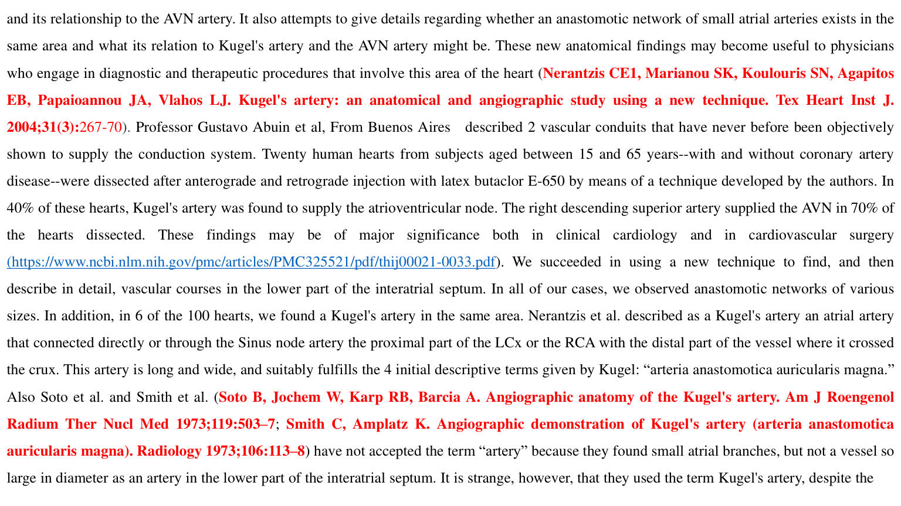

---

## 第 54 页

事实上，他们只描述了该区域的吻合网络。内兰齐斯等人。在 100 个正常心脏中仅发现了 6 个 Kugel 动脉（6%）。文献中也报道了类似的百分比，范围在 3.6% 到 6% 之间，尽管是在患有严重动脉粥样硬化性心脏病的患者中。
在 3 项冠状动脉造影研究中（Grollman JH Jr、Heger L. 左 Kugel 动脉的血管造影解剖学。Cathet Cardiovasc Diagn
1978；4：127-33；莱文 DC.冠状动脉侧支循环的途径和功能意义。 1974 年发行；50：831–7；索托乙，
Jochem W、Karp RB、Barcia A。库格尔动脉的血管造影解剖学。 Am J Roengenol Radium Ther Nucl Med 1973；119：503–7）。另一方面，在解剖学研究中，这一比例在 40% 到 66% 之间。这些增加的百分比可能包括以下情况
一个大的吻合网络。很难解释为什么其他作者在他们的研究中没有报告任何百分比。库格尔动脉起源于
3 颗心脏中的 LCx 以及另外 3 颗心脏中的 RCA（最后 1 颗心脏中通过窦房结动脉）。 Nerantzis 结果，根据之前
出版物清楚地表明这条动脉没有标准的起点。他们的6颗心脏中，库格尔的动脉直接相连
穿过十字路口后与远端动脉相连，保持独立于 AVN 动脉的路线。 BY 也描述了同样的发现
Thompson (Thompson AJ, Froelicher VF. Kugel 动脉作为严重冠心病的主要侧支通道。Aerosp Med 1974; 45(11):1276–80)。库格尔报告说，在某些情况下，他的动脉直接与远端 RCA 连接，而在所有其他情况下，它通过
AVN 动脉。

大多数在解剖学和血管造影研究中发现库格尔动脉的作者都提到了它的间接作用
与穿过症结的动脉的连接，总是通过索托和史密斯的 AVN。库格尔动脉很难证明
死后血管造影，并且在通常的冠状动脉造影投影中也很难在体内看到。然而，通过 Nerantzis 的技术，
他们第一次成功地在死后血管造影中清楚地展示了这条动脉。 Nerantzis 还相信 Kugel 的动脉将
如果右动脉造影使用右斜投影，左动脉造影使用左侧侧投影，则很容易在体内进行演示。在
对于这两个投影，头侧角度通常有助于将动脉引入投影的中间，与 AVN 平行

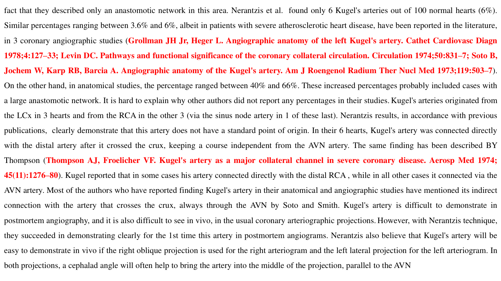

---

## 第 55 页

动脉，从而避免与房室沟中的血管重叠。在所有 100 颗心脏中都发现了吻合网络，将
间接连接大冠状动脉的近端和远端部分——66例通过AVN动脉，其余病例通过冠状动脉的小分支
穿过症结的动脉。大多数研究都描述了这种通过 AVN 动脉的连接。窦房结动脉或其
分支有助于该网络的形成，这一点已被提及。内兰齐斯等人。观察了参与
右上降动脉，但由于发现的病例较少，因此他们没有详细描述这一点。他们相信
我们的技术将使正常心脏网络的死后血管造影显示令人满意，但体内动脉造影
与库格尔动脉不同，由于血管尺寸较小，该网络的演示仍然非常困难。在其他研究中，所有这些
在主要心外膜冠状动脉狭窄病变的心脏中，冠状动脉间和冠状动脉内吻合往往较大。既然两者
库格尔动脉和吻合网络起源于冠状干的起点，在许多情况下都必须考虑到它们
涉及主动脉根部的外科手术。此外，进行涉及下肢手术的介入心脏病专家
房间隔，如射频消融和双心室起搏器植入，应意识到损坏这些的潜在风险
重要的吻合分支。

总之，根据 Nerantzis 等人的观察，小心房分支的吻合网络穿过心房下部
房间隔，并且在所有情况下间接连接较大冠状动脉的近端和远端，而库格尔动脉，
在 6% 的病例中，在同一区域提供直接动脉吻合术。这些发现的知识对于解剖学家来说很重要，
心脏病专家和心脏外科医生幻灯片 56 和 57 的图。

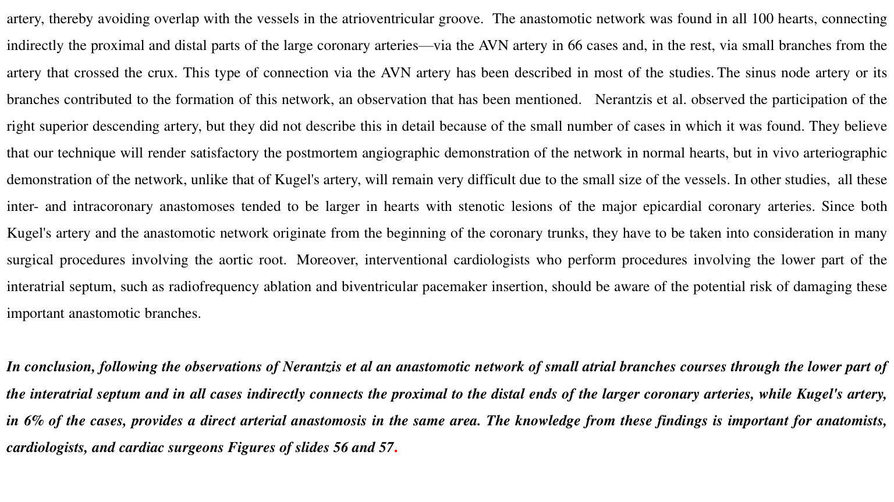

---

## 第 56 页

正常右主心脏中部的俯视图，其中包含穿过心脏的动脉及其分支
房室沟和房间隔下部。动脉造影显示库格尔动脉（K红色箭头）直接
将近端左旋支动脉与靠近关键点的远端右冠状动脉 (RCA) 连接（冠状动脉间连接）。
库格尔动脉在其整个走行过程中分布着分支。还可以看到独立的房室结 (AVN) 动脉。
此外，还显示了形成吻合网络的心房分支。

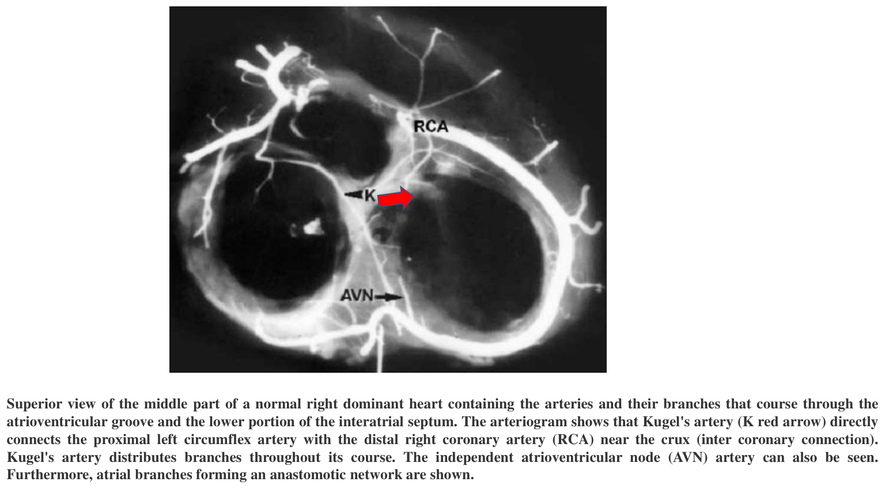

---

## 第 57 页

正常右主心脏中部的俯视图，其中包含穿过房室的动脉及其分支
沟和房间隔下部。动脉造影显示心房分支 (B) 起源于左近端
回旋动脉和 RCA 连接并形成吻合网络 (N)。它还显示了房室结 (AVN) 的贡献
动脉网络。请注意，显示的心房分支作者放大了该图以更好地演示网络，也因为
库格尔动脉的缺失使它们变大。

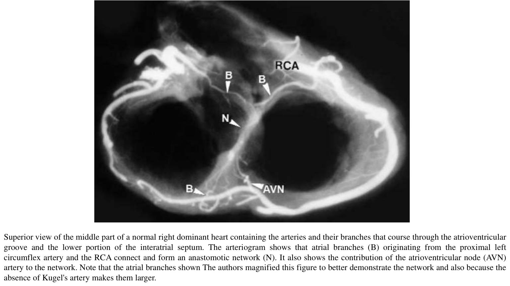

---

## 第 58 页

库格尔动脉。 A）右冠状动脉和左冠状动脉之间的吻合。
古斯塔沃·阿布因教授
库格尔动脉 
布宜诺斯艾利斯大学 | 
布法罗大学·解剖学系
图 1、2 和 3 Gustavo Abuin
目前在该部门工作 
解剖学，布宜诺斯艾利斯大学。 
古斯塔沃的研究 
心胸外科。

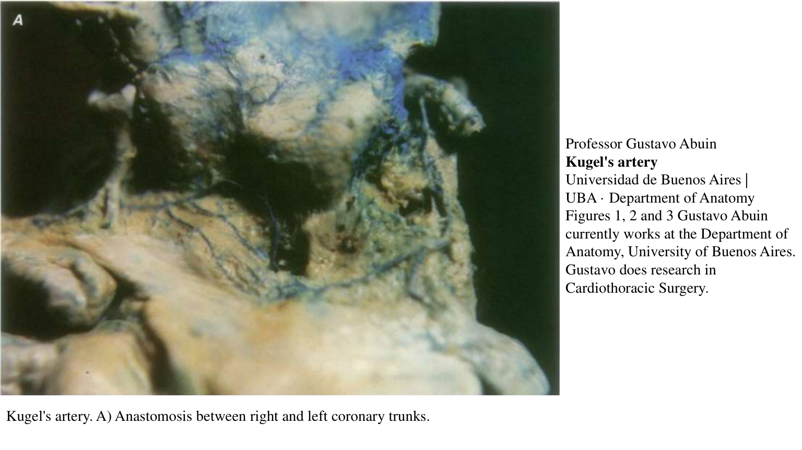

---

## 第 59 页

心房分支供应房室结（箭头）。 
心脏传导的解剖结构
系统及其血液供应已
多年研究课题。然而，
几个
提案
有
从不
曾经
证明了。古斯塔沃·阿布因教授
等人描述了 2 种血管
有
从不
之前
曾经
客观地
显示为传导系统供电。
来自老年受试者的二十颗心脏
之间
15
和
65
年——与
和
没有冠状动脉疾病——
顺行和逆行后解剖
注射乳胶丁氯 E-650
一种由该公司开发的技术手段
作者。其中 40% 的心脏中存在 Kugel 的
动脉
是
发现
到
供应
的
房室
节点。
的
对
上降动脉供应
房室结存在于 70% 的心脏中
解剖的。这些发现可能是
专业
意义
两者
在
临床
心脏病学和心血管外科。

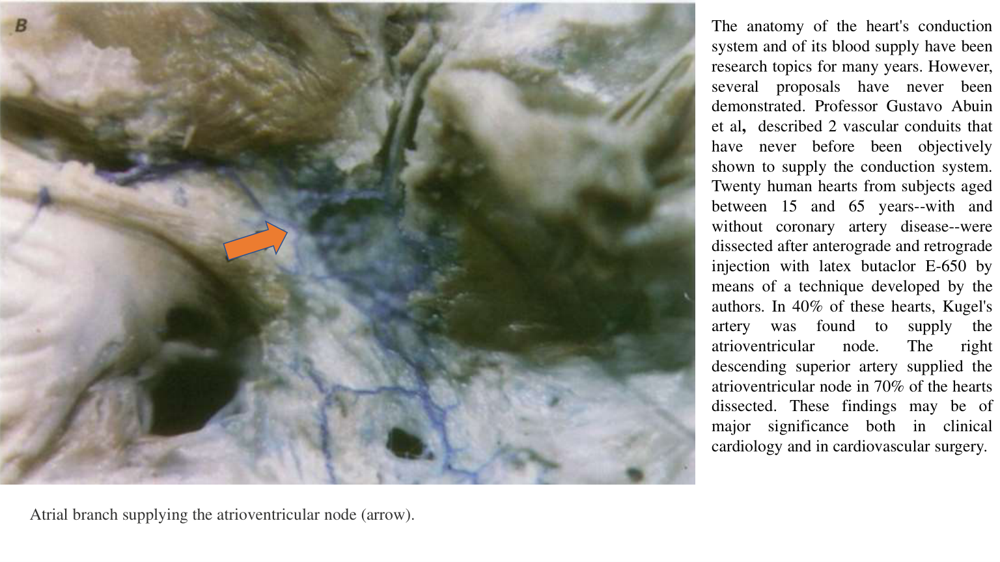

---

## 第 60 页

右上降动脉在供应房室结的 RCA 中发挥重要作用（箭头）。

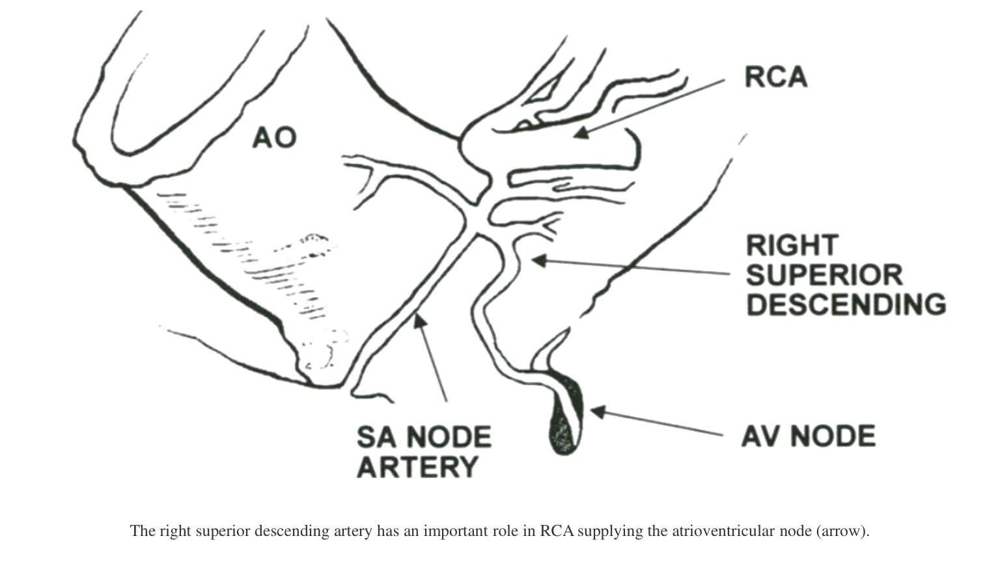

---
